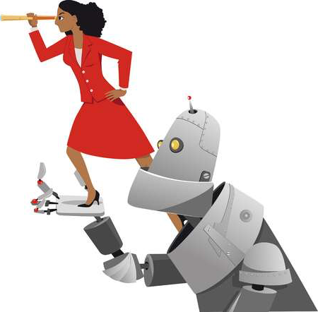

<a name=top>&nbsp;
 </a>
[home](http://tiny.cc/ase19#top) | 
[copyright](https://github.com/txt/ase19/blob/master/LICENSE.md#top) &copy;2019, tjmenzie&commat;ncsu.edu 
    
[syllabus](https://github.com/txt/ase19/blob/master/syllabus.md#top) | 
[src](http://menzies.us/fun) | 
[submit](http://tiny.cc/ase19give) | 
[chat](https://ase19.slack.com/) 

Fall 2019,   
CSC NC State,  
Professor: Tim Menzies <http://menzies.us>

Everyone else is studying AI, or applying AI to SE.
But what about SE for AI? 

AI software is still software. And software needs maintenance, validation, interfacing, usability additions, etc. That is why AI software needs software engineers!
And not only that, AI software offers special functions that need specialized approaches by software engineers. So what does engineering look like when applied to AI?

Time to find out.
Time to learn what happens after DevOps. 
While DevOps strives to "automate everything," automated software engineering strives to "automate automation." 
This subject will explore methods to augment standard software engineering practices with AI methods (data miners, optimizers, theorem provers) that peek over our shoulders to say "try this, and don't bother that."  
 

## Lectures

- [ignite](docs/ignite.md#top)

## Homework / Project

## Project

## Links
