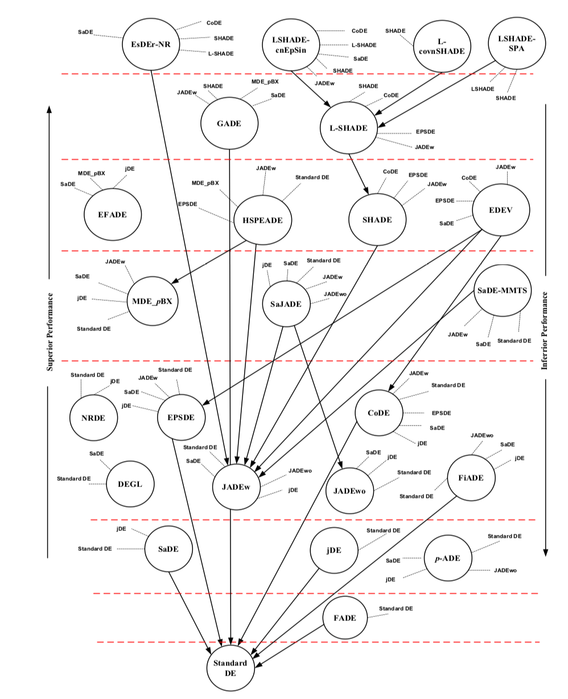

<a name=top>&nbsp;<p> </a>
[home](http://tiny.cc/ase19#top) | 
[copyright](https://github.com/txt/ase19/blob/master/LICENSE.md#top) &copy;2019, tjmenzie&commat;ncsu.edu 
<br> [](http://tiny.cc/ase19)<br> 
[syllabus](https://github.com/txt/ase19/blob/master/syllabus.md#top) | 
[src](http://menzies.us/fun) | 
[submit](http://tiny.cc/ase19give) | 
[chat](https://ase19.slack.com/) 


# Differential Evolution


## Motivation

In the 21st century, it is impossible to manually browse all
available software project data.  For example, at the time of this writing (Jan
2016), our web searches show that Mozilla Firefox has over 1.1
million bug reports, and platforms such as GitHub host over 14
million projects.

Faced with this data overload, researchers in empirical SE
use data miners to generate defect predictors from static code
measures. Such measures can be automatically extracted from
the code base, with very little effort even for very large software
systems.

One of the "black arts" of data mining is setting the tuning
parameters that control the choices within a data miner. Prior
to this work, our intuition was that:

- tuning would change the
behavior or a data miner, to some degree. 


Nevertheless, we
rarely tuned our defect predictors since we reasoned that:

- a data
miner’s default tunings have been well-explored by the developers
of those algorithms (in which case tuning would not lead
to large performance improvements).
- Also, we suspected that
tuning would take so long time and be so CPU intensive that
the benefits gained would not be worth effort.

Wrong and wrong (at least for SE). Let me show you why.

# DE = Simple

From [http://en.wikipedia.org/wiki/Differential_evolution](http://en.wikipedia.org/wiki/Differential_evolution).

Differential evolution (DE) is a method that
optimizes a problem by iteratively trying to
improve
a candidate solution with regard to a given measure
of quality. Such methods are commonly known as
metaheuristics as they make few or no assumptions
about the problem being optimized and can search
very large spaces of candidate solutions. However,
metaheuristics such as DE do not guarantee an
optimal solution is ever found.

DE is used for multidimensional real-valued
functions but does not use the gradient of the
problem being optimized, which means DE does not
require for the optimization problem to be
differentiable as is required by classic
optimization methods such as gradient descent and
quasi-newton methods. DE can therefore also be used
on optimization problems that are not even
continuous, are noisy, change over time, etc.

DE optimizes a problem by maintaining a population
of candidate solutions and creating new candidate
solutions by combining existing ones according to
its simple formulae, and then keeping whichever
candidate solution has the best score or fitness on
the optimization problem at hand. In this way the
optimization problem is treated as a black box that
merely provides a measure of quality given a
candidate solution and the gradient is therefore not
needed.

Invented by:

+ Storn, R.; Price, K. (1997). "Differential
evolution - a simple and efficient heuristic for
global optimization over continuous spaces". Journal
of Global Optimization 11:
341-359. doi:10.1023/A:1008202821328.

+ Storn, R. (1996). "On the usage of differential
evolution for function optimization". Biennial
Conference of the North American Fuzzy Information
Processing Society (NAFIPS). pp. 519-523.

For further  information:

+ [Differential Evolution Home page](http://www1.icsi.berkeley.edu/~storn/code.html)
+ Includes DE implementations in dozens of languages.


## DE's Intuitions

When building a new population, do not just add promising
members into the old:

+ That way leads to over-population (computationally slower);
+ Instead, if you find something better, jettison something else.

When finding the frontier, do not do all pairs comparison

+ Too slow
+ Instead, compare frontier to randomly generated items
  + Replace any dominated ones


When building mutants:

- Build those mutants using an archive of known good solutions 
   
When building new candidates, extrapolate between
members of the current frontier:

+ No needs for frequency tables of better ranges
  + The frontier _has_ the better ranges;
+ Pick three things (X,Y,Z);
+ At some probability (called the crossover factor):
  + _New = X + f * (Y - Z)_
   
## Code

Warning: pseudo-code only. Never executed.
    
### Some model feature selectors

Somehow, your models need to be able to report themselves as follows.

Ranges for decision _d_:

```python
    def lo(d): # return max range of decision d
    def hi(d): # return min range of decision d
```

List of decision indexes:

```python
  def decisions(): # return list of indexes of the decisions
```

Making sure something is in range:

```python
  def trim(x,d)  : # trim to legal range
      return max(lo(d), min(x, hi(d)))
```

Creating a new candidate. Candidates are things with
_id,score_. They also  _have_ some decisions
which
are initialized at random from _lo_ to _hi_.

```python
  def candidate():
    myDecisions = [lo(d) + n(hi(d) - lo(d)) 
                   for d in decisions()])
    new = Thing()
    new.have = myDecisions
    return new

  def n(max):
    return int(random.uniform(0,max))

  class Thing():
    id = 0
    def __init__(self, **entries): 
      self.id = Thing.id = Thing.id + 1
      self.__dict__.update(entries)
```
 
### Differential Evolution
    
Main function (which looks like any other evolutionary optimizer)
creates an frontier, tries to update it, stopping if we are good enough:

```python
    def de(max     = 100,  # number of repeats 
           np      = 100,  # number of candidates
           f       = 0.75, # extrapolate amount
           cf      = 0.3   # prob of cross-over 
         ):
      frontier = [candidate() for _ in range(np)] 
      for _ in range(max):
        frontier =  update(f,cf,frontier)
      return frontier
```

Action at each iteration. Make sure we have a score
for the old timer on the frontier.  If some newly
created candidate is better than the old timer, then
replace the old timer with the new candidate (and
update the cache of scores). Returns the total
of scores of the frontier (and its size).
    
```python
    def update(f,cf,frontier):
      for pos,old in enumerate(frontier):
        new = extrapolate(frontier,old,f,cf)
        if better(new,old)
          frontier[pos]= new
      return frontier
      
    def better(this,that):
      "indicator or binary domination"
      ...
```

Note one design choice in the above: better mutants
get added into the frontier as soon as we find them;
i.e. during one pass over the frontier, it might be
possible to revisit mutations made earlier in that single
pass.

The core DE extrapolation-based mutator.
Alters a field at probability _cf_,  _X + f*(Y - Z)_. 

```python
  def extrapolate(frontier,one,f,cf):
    out=Thing()
    out.have = [None for _ in one.some]  # empty box
    two,three,four = threeOthers(frontier,one)
    changed = False  
    for d in decisions():
      new = d
      if rand() < cr:
        x,y,z = two.have[d], three.have[d], four.have[d]
        changed = True
        new     = x + f*(y - z)
      out.have[d]  = trim(new,d) # keep in range
    if not changed:
      d      = a(decisions())
      out.have[d] = two[d]
    out.score = score(out) # remember to score it
    return out 
  
  def a(lst) :
    return lst[n(len(lst))]
```

In the above code, note the use of the _changed_
variable that assures us that at least one new value
is introduced into _out_.

Finally, one small detail. The function _threeOthers_
finds 3 items from frontier that are different
to the parent we might be replacing. For our
definition of _different_, we will use that _id_
value
stored in our candidate:

```python
  #Returns three different things that are not 'avoid'.
  def threeOthers(lst, avoid):
    def oneOther():
      x = avoid
      while x.id in seen: 
        x = a(lst)
      seen.append( x.id )
      return x
    # -----------------------
    seen = [ avoid.id ]
    this = oneOther()
    that = oneOther()
    theOtherThing = oneOther()
    return this, that, theOtherThing
```

## Storn97's  Parameter Recommendations

The _CR_ has  range one to zero.

+ Try _CR_=0.3
+ If no convergence, try _CR_ in the range 0.8 to 1

For many applications:

+ _NP_=10 times the  number of decisions. 

_F_ is usually chosen 0.5 to 1.

+ The higher the population size NP is chosen, the lower _F_.

## Variants of DE

DE is actually a family of algorithms, all doing similar
things to the above.

Recall that the above DE mutated as follows:

+ _X + F*(Y - Z)_

Storn denotes DE variants as _DE/selection/extrapolations_.
For example, the above DE is actually DE/rand/1; 
     
+ We extrapolate from some candidate _X_, chosen at random.
+ We only add in values from one other extrapolation

DE/best/2 would use two extrapolations, but based on the
  best _X_ seen so far:

+ _Xbest + F * (A + B - Y - Z)_
+ Here, _A,B,Y,Z_ are candidates selected at random

DE/rand-to-best/1 places the perturbation at a location 
  between a randomly chosen population member and the best
  population member: 

+ _X + D*(Xbest - X) + F*(Y - Z)_
+ Here, _D_ is some number 0..1

DE/closest/1 would select _X_ to the instance
  closest to the parent we are considering replacing. 
  How to measure closeness? Well:
  
+ DE/closest(dec)/1 would find the closest in decision space;
+ DE/closest(obj)/1 would find the closest in objective space;
 
I leave it to your imagination to invent new DE variants.
But note the computational cost of the above:

+ The _best_ variants can be fast since the only extra stuff
  here is to test each new candidate as it is created and 
  remember the best seen so far (that takes linear time).
+ The _closest_ variants can be very slow: all those distance
  calculations! (and much slower in decision space than objective space: why?).
  

## Applications of DE to SE

+ [Tuning for Software Analytics: is it Really Necessary?](http://arxiv.org/abs/1609.01759) by Wei Fu, Tim Menzies, Xipeng Shen. 
  IST journal, 2016.
+ [What is Wrong with Topic Modeling? (and How to Fix it Using Search-based SE)](http://arxiv.org/abs/1608.08176)
  by Amritanshu Agrawal, Wei Fu, Tim Menzies. Submitted to ICSE'17.


## Latest results

So many variants of ye olde DE:


Recent surveys on DE: 

- [Recent advances in differential evolution–an updated survey (2016)](https://www.researchgate.net/profile/Swagatam_Das/publication/292616241_Recent_Advances_in_Differential_Evolution_-_An_Updated_Survey/links/5abcce72aca27222c753f36a/Recent-Advances-in-Differential-Evolution-An-Updated-Survey.pdf)
- [Al-Dabbagh, R. D., Neri, F., Idris, N., & Baba, M. S. (2018). Algorithmic design issues in adaptive differential evolution schemes: Review and taxonomy. Swarm and Evolutionary Computation, 43, 284-311.](https://dora.dmu.ac.uk/bitstream/handle/2086/15528/SWEVO_2017_529_Revision%202_V0%20%283%29.pdf?sequence=1&isAllowed=y)

A subjective opinion on what DE variants work best:


