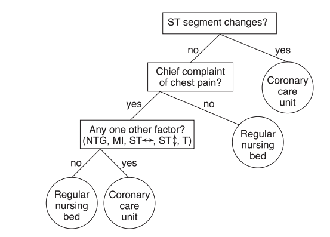
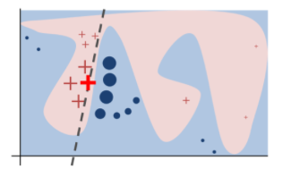
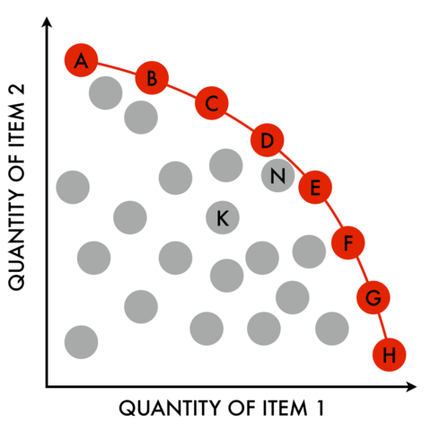

<a name=top>&nbsp;
 </a>
[home](http://tiny.cc/ase19#top) | 
[copyright](https://github.com/txt/ase19/blob/master/LICENSE.md#top) &copy;2019, tjmenzie&commat;ncsu.edu 
    
[syllabus](https://github.com/txt/ase19/blob/master/syllabus.md#top) | 
[src](http://menzies.us/fun) | 
[submit](http://tiny.cc/ase19give) | 
[chat](https://ase19.slack.com/) 

# Ethics

The premise of this book is that AI tools offer a rich tapestry of
choices that software engineers can weave through to a variety of
goals (and which can include ethical goals).  This chapter offers
specific examples of that process.

We explore ethics since, More and more, AI tools  are making decisions
that affect people’s lives in such high-stakes applications such
as mortgage lending, hiring, and prison sentencing. Many high-stake
applications such as finance, hiring, admissions, criminal justice
use AI decision-making frequently:
 [Ladd'98](REFS.md#ladd-1998);
 [Burrell'16](REFS.md#burrell-2016);
 [Corbett'18](REFS.md#corbett-2018);
 [Galindo'00](REFS.md#galindo-2000);
 [Yan'13](REFS.md#yan-2013);
 [Chalfin'16](REFS.md#chalfin-2016);
 [Ajit'16](REFS.md#ajit-2016);
 [Berk'15](REFS.md#berk-2015);
 [Berk'16](REFS.md#berk-2016).

Unfortunately, some of  AI tools are  known to exhibit “group
discrimination”; i.e. their decisions are inappropriately affected
attributes like race, gender, age, etc:

- One older version of a [sentiment analyzer from Google](REFS.md#Google-2017) gave negative (and wildly
inappropriate) scores to sentences like 
"I am a Jew" and "I am homosexual".
- A popular photo tagging app assigned [animal category labels](REFS.md#Google_Photo) to dark skinned people.
- Recidivism assessment models predict who might commit crimes, in the future. Some such models used by the criminal justice system are more likely to
[falsely label black defendants as future criminals](REFS.md#Machine_Bias) (at twice the rate as white defendants).
- Facial recognition software which predicts characteristics such as gender, age from images has been found to have a
[much higher error rate](REFS.md#skin-bias-2018) for dark-skinned women compared to light-skinned men
- Amazon.com stopped using automated recruiting tools after finding [anti-women bias](REFS.md#Amazon_Bias).

We say that, to some degree, the ethical impact of AI tools can be
controlled by the developers building that software. We stress "to
some degree" since the best ethical intentions of any developer can
be defeated by  malevolent forces, or even by just dumb luck.  So
it is wrong to say that if our guileless are followed that the
result AI tool will always adhere to socially-accepted ethical
standards.

But it also wrong to say that just because some ethical goals are
not always reached, that we should not strive towards those goals.
Developers will always try to adhere to ethical standards.  Or, at
the very least, they should monitor their AI tools and report
unethical usage or consequences.

## Technical Choices

Our point will be that, in the 21st century, the wise software
engineering knows how  different AI tools offer different services,
and how some of those services can achieve certain ethical goals.
We offer fair warning to the reader versed in the standard texts
on, say, data mining.  The technologies discussed below roam far
away from standard discussion of (say) classification vs regression
vs whatever else. Once we introduce ethical goals like inclusiveness
or fairness then the technology choices become very different.

The following methods are discussed above, very briefly
(and for
more details, see later in this book):

- Cognitive pyschology; specifically, "frugral trees";
- Data pre-processors like feature selection;
- Classifiers like Naive Bayes and KNN (kth-nearest neighbor);
- Neural net methods like deep learning;
- Theorem provers like picoSAT; XXX
- Meta-learning schemes like active learning.
- Optimizers like sequential model-based optimization (a kind of active learning);
- Multi-goal optimizers that can explore the trade-off between multiple goals.
- Hyperparameter optimizers (again, like sequential model-based optimization);
- Explanation algorithms like LIME or frugal trees;
- Genetic algorithms;
- Certification envelope technology such as prototype discovery and anomaly detection
- Repair algorithms, which can include contrast set learners and tabu-planners;
- Clustering algorithms, and hierarchical clustering using recurisve random projections;
- Incremental learning that updates its models after seeing each new example.

For the industrial practitioner who wishes to distinguish themselves
within the currently crowded AI market, the above list might be a
marketing opportunity.  By augmenting their current toolkit with
some of the above, industrial practitioners might be able to offer
services that is absent amongst their  rivals.

For the researcher who is an advocated of a particular AI tool, the
above list might inspire a research challenge:

- First, they might seek ways  to extend their preferred AI tool
such that it covers the more of the above services.
- Secondly, they might scoff at this list, saying "I can do better than that". If they then went on
to implement and evaluate their alternative, then that would be a very good thing
(since that would give us more material for version two of this book).

For us, this list is like a specification for an ideal "ethics
machine".  Later in this book we offer a version 0.1  implementation
of that ethics machine.  As will be seen, that implementation
requires much extension  and improvement.  Nevertheless, it does
show that a surprisingly large portion of the above can be created
in a relatively simple manner. It is hoped that that implementation
seeds a research community devoted to exploring algorithms with
ethical effects.

## Current Ethical Concerns

The  [Institute for Electronics and Electrical
Engineers](REFS.md#IEEEethics-2019) (IEEE) has   recently discussed
general principles for implementing autonomous and intelligent
systems (A/IS).  They propose that the design of such A/IS systems
satisfy certain criteria:

1. _Human Rights:_ A/IS shall be created and operated to respect, promote, and protect internationally recognized human rights.
2. _Well-being:_ A/IS creators shall adopt increased human well-being as a primary success criterion for development.
3. _Data Agency:_ A/IS creators shall empower individuals with the ability to access
   and securely share their data, to maintain people’s capacity to have control over their identity.
4. _Effectiveness:_ A/IS creators and operators shall provide evidence of the effectiveness and fitness for purpose of A/IS.
5. _Transparency:_ The basis of a particular A/IS decision should always be discoverable.
6. _Accountability:_ A/IS shall be created and operated to provide
   an unambiguous rationale for all decisions made.
7. _Awareness of Misuse:_ A/IS creators shall guard against all potential misuses and risks of A/IS in operation.

Other  organizations, like [Microsoft](REFS.md#microai-2019)
offer their own principles for AI:

- _Transparency_ AI systems should be understandable
- _Fairness_: AI systems should treat all people fairly
- _Inclusiveness_  AI systems should empower everyone and engage people
- _Reliability &amp; Safety_ AI systems should perform reliably and safely
- _Privacy & Security_: AI systems should be secure and respect privacy
- _Accountability_: AI systems should have algorithmic accountability

Ethics is a rapidly evolving concept so it hardly surprising to say
that mapping the stated ethical concerns of one organization
(Microsoft) into another (IEEE) is not easy.  Nevertheless, the
following table shows one way we might map together these two sets
of ethical concerns. Note that:

- "accountability" and "transparency"  appear in both the IEEE and Microsoft lists. Clearly these
  are concerns shared by many people.
- Missing from the Microsoft list is "effectiveness" but
  we would argue that what IEEE calls "effectiveness" can be expressed
  in terms of other Microsoft terms (see below).
- Assessed in terms of the Microsoft terminology, the IEEE goals or "well-being" and "awareness of misuse"
  are synonyms since they both reply on "fairness and "reliability and safely".

|                | Accountable|Transparent|Fairness |Rely+Safe|Inclusivex|Private+Secure|
|----------------|------------|-----------|----------|----------|----------|--------------|
|Accountability  |  &#10004;  |           |         |         |         |              |
|Transparency    |            |  &#10004; |         |         |         |              |
|Well-being + aware of misuse||        | &#10004;| &#10004;|         |              |
|Human-rights    |            |           | &#10004;|&#10004; |&#10004; |              |
|Data agency     |            |           |         |         |&#10004; |   &#10004;   |
|Effectivenessx   |   &#10004; |           |         |&#10004; |         |   &#10004;   |

The reader might dispute this  mapping, perhaps saying  that we
have missed, or missed out, or misrepresented, some vital ethical
concern.  This  would be a good thing since that would mean you are
now engaging in discussions about software and ethics.  In fact,
the best thing that could happen below is that you say "that is
wrong; a better way to do that would be..." As  George Box said,
all models are wrong; but some are useful.

In any case, what the above table does demonstrate is that:

- Large organizations are now v:e REery concerned with ethics. 
- When they talk about ethics, there is much overlap in what they say.
- This is a pressing need to extend our current design thinking for AI tools. Hence, this book.
 
## From Ethics to Algorithms

The above table maps between ethical concerns  from different organizations.
The rest of this chapter discusses how different algorithm choices enable these
ethical goals.  

### Effectiveness

It is unethical to deliver an AI tool that is performing poorly,
particularly when there are so many ways to make an AI tool perform
better.  As discussed in our chapter on [Baselines](about-basleines),
no AI tool works best for all problems. Hence, we exploring new
problems, there must be a _commissioning_ process where different
AI tools are explored and/or adjusted to the local problem:

- AI tools come with defaults from their control settings. Those defaults may
be wildly  inappropriate for new problem.  For examples of this of this, see
Section 2 of [Nair et al.](REFS.md#nair-2018).  Hyperparameter optimizers are
tools for automatically finding tunings that can greatly improve effectiveness.
For examples of this, see [Fu et al.](REFS.md#fu-2016) and [Agrawal et
al.](REFS.md#agrawal-2018a). One way to implement such hyperparameter optimization
is via active learning (see below). 

The faster the algorithm,
the easier it is to fiddle with. So measured in terms of
_commissioning effort_,
 we prefer linear time methods (e.g.  Naive Bayes)
to very slow algorithms (e.g. KNN,  that scale very poorly to large 
data sets).

- Naive Bayes classifiers keep different statistics on rows of different
classes. When new data arrives, such a classier can be quickly updated, just by
adding to the stats of the class of that new row.  
- On the other hand, KNN algorithms make conclusions by interpolating between
the k nearest neighbors.  In practice, this is very slow since finding the
Kth-nearest neighbors requires a full pass over all the training data for each
new test instance.
- KNN can be made faster via clustering algorithms that group together similar examples.
  Once grouped, KNN only needs to within a group. 
- Just as an aside, clustering can be made very fast using tricks
like 
recursive random projections (RRP).
After a few random samples, it is possible to find two moderately distant points "_east_" and "_west_"
Data can be clustered into two groups, depending or if they are closest
to "_east_" or "_west_".
Repeating this recursively "_D"_ times generates a tree of clusters of depth "_D_",
the leaves of which holds
data that is 
similar according  to "_D_" random projections  over "_east,west_" pairs.

It is important to stress that the  commissioning   effort cannot be the only way we assess
an AI tool.  For high dimensional image data, deep learning] has
proved to be very effective.

- Deep learners are n-layered neural networks were layer "i" find
new features hat layer "i+1" uses to make new conclusions.

Training such learners can be a very slow process, so tuning and
comparing with other learners may be impractical.  In this book we
made no case that deep learning (or any other AI tool) is inherently
better or worse. Rather, our goal is to  map the trade-offs associated
with  AI tool such that the best one can be selected from the next
problem.

### Fairness

Machine learning software, by its nature, is always a  form  of  statistical  discrimination.   This  discrimination becomes objectionable when it places certain social groups  (e.g. those characterized by age, sex, gender, nationality) at  a  systematic  advantage or  Disadvantage

There are various measures that can be applied to measure unfariness.
The
first step is to identify “protected attributes” (e.g. race, age,
gender, etc). Next, we use all attributes (privileged and otherwise)
to build a classifier.  Thirdly, we measure unfariness
using measures like:

- EOD: the delta of true positive rates in unprivileged and privileged groups;
- AOD: the average delta in false positive rates and true positive rates between privileged and unprivileged groups.   

After that, handling unfairness becomes a 
hyperparameter optimization issue.
 Recent result shows that hyperparameter  tuning can find
fairer models (where “fair”  measured by EOD and AOD). The trick
here is that such optimization must strive for fairness AND performance
(precision, recall etc) since [experiments show](REFS.md#chak-2019) that optimizing
for performance separately to fairness means that we can succeed
on one and fail on the other.

### Inclusiveness

AI tools that include humans in their reasoning process must do several  things:

1. They must not unfairly discriminate against particular social groups (see above).
1. The humans must be be able to understand  why an AI tool has made a conclusion.  
    - For this purpose, explanation algorithms are useful.
2. Humans must be able to adjust that conclusion. 
    - For this purpose, active learning is useful.
3. Further, to better support the above, AI tools must understand and respect the goals of the humans involved in this process. 
    - For this purpose, multi-goal reasoning is useful.

 
#### Explanation

Inclusiveness is helped by AI tools that generate succinct human-readable
models since  humans can read and understand  such models.  Rule-based learners
like  contrast set learners and FFTrees are useful for generating such succinct
models:

- According  to [George Kelly](REFS.md#kelly-1955), humans reason about the world
via lists of differences between things (as apposed to list of things abut each
object). This is an interesting since the list of obvious difference between
things can be [much shorter than a description of the
things](REFS.md#menzies-2003) (e.g. the difference between clouds and oceans is
that one you have to look up to see one of them).  Contrast set learners can
generate very short rules describing a domain by reporting the difference
between things, weighted by the frequency of each of difference. 
-   According to  [Gerd Gigerenzer](REFS@gigerenzer-2008), humans reason in a
"frugal manner"; that is, they ignore much of the available information to find
good-enough solutions[^simon].
      - A [frugal tree generator](REFS.md#phillips-2017) 
        ranks different divisions of data columns according the goal of the learning (e.g. for each division, how
   many positive/negative examples does in cover).  
      - Next, various   learning
biases are tested.  At every level of its tree building, FFtrees fork sub-trees
for
   two biases (the subsets of the data that do/do not match the worst/best division). 
       In this way, dividing "_N_" levels produces $$2^N$$ different
      trees.   The tree that performs best (on the training data) is then selected to apply to the test data. 
      - In practice, frugal trees  are binary trees of depth four or less. Humans can quickly glance at such
  trees, [then critique or apply them](REFS.md#gigerenzer-2008). Despite their small size, they can be [remarkably effective](REFS.md#chen-2018).

[^simon]: Gigerenzer's thinking was  influenced by the Nobel-Prize winning economist and AI pioneer Herbert Simon.  [Simon argued](REFS.md#simon-1956) that humans do make optimizer decisions, since such optimality assumes complete knowledge about a situation.  Rather, says Simon, humans reason via "satisficing" ( a portmanteau of satisfy and suffice) in which they seek solutions good enough for the current context.

Another interesting approach  to explanation is to use locality reasoning.
The  [LIME explanation algorithm](REFS.md#riberio-2016) 
 builds some model $$M_1$$ using examples near the
example of interest (LIME does not specify which model is used). 
Next, LIMES builds a local regression mode $$M_2$$ using the predictions from $$M_1$$. The coefficients of $$M_2$$
are then informative as to what factors are most influential.
For example, in  the diagram at right, the example of interest is marked with a red cross and the $$M_2$$ coefficients
would reveal why this example is labeled (say) ref, not blue).

For a discussion of other explanation algorithms, see  [Gosiekska and Biecek](REFS.md#gos-2019).

#### Active Learning

Once a system can explain itself, then most probably humans will want to change some part of it.
Active learning is a general framework within which humans and AI can learn from each other, in
the context of specific examples.

- Active learners  incrementally build models using the minimum number of queries
  to some oracle (e.g. some human). 
     1. For example, if some as-yet-unlabelled examples fall near the decision
  boundary between two classes, then  the label for that example is _uncertain_. 
     2. One active learning stratefy is to
  ask the oracle about the next most uncertain example, the  update the model using that new information.
     3. Such learning strategies often dramatically descreses the number of examples
       need to build a ground truth or comission a model.
- Active learning is simpler when models can quickly update themselves.
    - Examples of such fast incremental update algorithms include Naive Bayes and RRP and many others besides.
- Sequential model-based optimization (SMBO) is an active learner that assumes it is fast to guess
  a value for a new example (if we have a model) but slow to confirm that guess (by running some oracle).
     - For example, when optimizing a data miner,
  SMBO might explore random settings to the control parameters of that learner. 
     - As it evaluates different
  settings, it builds  a model predicting the effect of a particular setting.
     -  The next setting it tries
  might be the one that is guessed to [achieve the highest predicted  score](REFS.md#nair-2018).

#### Multi-goal Reasoning

One of the lessons of research into requirements engineering is that the stakeholders for software
have many competing goals. 
Simple AI tools know how to chase a single goals (e.g. a classifier might try to maximize the accuracy
of its predictions).  Better AI tools now how to trade off between the multiple competing
goals of different  stakeholders.

One way to trade-off between competing goals are multi-goal reasoners. 
Pareto frontiers were introduced in [Chapter 3](/about-tools#optimizers) in the section discussing
how data miners use optimizers. Recall that, given many solutions floating in a space of multiple goals,
the "Pareto frontier" are those solutions that are not demonstrably worse that anything else. In the figure at right,
if we wish to maximize both the quantities, then "heaven" is top right so "_K,N_" are not on the frontier
(since there are other items between them and heaven). On the other hand, 
 "A,B,C,D,E,F,G,H" are on the frontier since they have a clear line of sight to heaven.

There are many methods for finding the Pareto frontier including
genetic algorithms
and sequential model-based optimization and the three data mining methods described below.
Once the frontier is found, the reasoning can stop. Alternatively, in multi-generational reasoning,
this frontier becomes the seed for a new round of reasoning.

#### Multi-goal Reasoning via Data Mining

One of the lessons of this book is that building ethical systems is not hard. If developers really
understand how their AI tools work, it is possible to refactor them and produce simpler 
systems that can better achieve the desired goals. For example, in this section, we offer
three very simple data mining methods that implement multi-goal optimization.  

One way to use data mining method to implement multi-goal reasoning
is via recursive random projections. [Krall et al.](REFS.md#krall-2015) 
and [Chen et al.](REFS.md#chen-2019)
 applied RPP to randomly generated candidates. Instead of evaluating all $$N$$  candidates,
Krall and Chen just evaluated the $$O(log_2(N))$$ "_east_,_west_" pairs. There approach achieved
similar (and sometimes better) results than
standard optimizers while running much faster (for one large model, RRP terminated in minutes, not the hours required
for standard optimizers).
Chen et al. improved on Krall's work by showing that if the initial candidate size was large (say $$10^4$$)
then (a) multi-generational reasoning was not required while at the same time leading to (b) results
competitive with other methods.

A second  way to use data mining to implement multi-goal reasoning is via frugal trees.
Recall from the above that a
frugal tree generator
        ranks different divisions of data columns according the goal of the learning.
[Chen et al.](REFS.md#chen-2018) out-performed the prior state of the art (in one are)
by ranking their divisions using a pair of two-dimensional goals:

- Goal1: minimize false alarms, maximize recall
- Goal2: maximize for most program defects seen in the minimal  number of lines of code.

A third way to use data mining to implement multi-goal reasoning is to use
contrast set learning and the 
[Zitler and Künnzli](REFS.md#zitler-2004) indicator measure $$I$$
In the following equation,
$$x_i$$ and $$y_i$$ are the i-th goal of row $$x,y$$  and
 $$x_i'$$ and $$y_i'$$ are those goals normalized 0..1 for min..max. 
Each of the "_N_" goals is weighted $$w_i=-1,1$$ depending on whether or not we seek to minimize or maximze  it.

$$
I(x,y)=\frac{-1}{N}\sum_i^N 10^{w_i(x_i'-y_i')/N}
$$

Row $$x$$ is better than row $$y$$ if we "lose more"
  going $$x$$ to $$y$$ than going  $$y$$ to $$x$$; i.e.  $$I(x,y) < I(y,x)$$.
Rows can be   sorted according to  how many times they are better than
  (say) $$M=100$$ other rows (selected at random). 
Contrast set learning can then be applied
  to discover what selects for the (say) 20% top scoring rows (while avoiding the rest).
Note that, in practice, we have seen
  this indicator measure [work well for up to 5 goals](REFS.md#sayyad-2013).

These three examples demonstrate the value of understanding AI tools. 
All the above refactor existing AI tools (RRP, frugal trees, contrast set learning) to achieve
better systems: 

- In the case of RRP, the multi-goal reasoning ran much faster. 
- In the case of frugal trees, the resulting system out-performed the state of art. Also, it generated
  tiny models that could be readily read and understood.
- In the case of contrast set learner and the Zilter indicator, the resulting system is
  very easy to build.

This three points are an excellent demonstrator of the main point of this book: AI tools give
software developers more choices in how  to implement a system. 
Developers can use those choices they can use to great benefit, including ethical benefits).

### Reliability  and Safety

#### Reliability

Formally, reliability  is the  probability of failure-free software operation for a specified period of 
time in a specified environment.  Since  modern software is so complex, we cannot usually
assign such a probability. Instead, a more pragmatic goal for "reliable software"
is to decreases the odds that 
it is  will do harm, in the future.

Four tools for pragmatically assessing AI tool reliability are

- _Understanding the goals of the system._ As mentioned above, one of results of
  requirements engineering is most system stakeholders have multiple competing goals.
  Hence, when we talk about "doing harm", we must also carefully define
   "harm" for the perspective of the users. In practice, this requires some degree of
  trade-off between competing humans goals (enter multi-goal optimization).
- _Perturbation analysis_: In this approach,
  we mess with some aspect of the software the check the impact
   of that perturbation on the model. Note that, to some degree, the design of a system
   can be mitigate for perturbation. For example, randomly reordering the inputs can
   lead to certain clustering algorithms generating different clusters. [Agrawal et al.](REFS.md#agrawal-2018)
   report that learning parameters found by hyperparamter optimization can reduce that problem.
   For example, compare Table3 and Table8
    (after hyperparamter optimziation) in  https://arxiv.org/pdf/1608.08176.pdf
- _Certification envelopes_: In this approach, AI tools are  shipped with some data structure
   that summarizes the data used to certify that system. If some new input arrives, and it is
   outside of this certification envelope, then we know not to trust the conclusions of the AI. 
       - Note
   that for this to work, some anomaly detection algorithm must test if new inputs are outside
   of the envelope.
       - One way to build an anomaly detector is to use RRP. As a side-effect of computing distance to each "_east,west_"
  pair in any cluster, we can collect the mean and standard deviation of all the distances seen in that cluster.
  With that information, we can declare something to be anomalous if its distance is   
  [more than "_N_" standard deviations away from the mean](REFS.md#peters-2019).
       - Another way to build an anomaly detector is to continuing active learning (including SBMO) after the comissioning process.
  Anomalies can be reported when the predictions from active learning/SMBO do not
  match the newly incoming data.
- _Repair_ operators that can mitigate for poor behavior or the system leaving the certification envelope.
       - Hierarchical clustering tools like RPP make repair somewhat easier since they divide the whole monitoring problem
         into numerous smaller ones. In we colelct the anomalies seen in a subtree, and if the number
         of anomalies exceeds some threshold, then we can relearn our models/subtree using the data
         and anomalies in that sub-tree. Diana Gordon reports one application wherer this repair-in-subtrees
         method can tens of thousands times fsater than soem global reset and relearn over all data.
       - Another way to run repair operators is to never stop learning. If we keep running (e.g.) sequential
         model-based optimization whenever new data arrives, then our models will always be changing in
         response to new data. From a pragmatic perspective, this approach works best when the
         model within SMBO can update itself incrementally, very quickly.

Further to the last point, certification envelopes have two  major issues.
Firstly, from a privacy perspective, it is problematic to share data least it reveals
private information. For more on this point, see the next section.

Secondly , from a systems perspective, it can be primitively expensive to pass around large
  amounts of data with each AI tool. To address this problem, we suggest:

- Learning _prototypes_;
  i.e. rows of the data that are exemplars for many of their neighbors. Certification envelopes
  comprising prototypes can be much smaller than those comprising all the data.
To find  prototypes, run some clustering algorithm (e.g. RP) and the return only a random sample
  of examples within each cluster.
- Focus on anomalies. If data is passed from site to site, let each new site just 
  [add in their data](REFS.md#peters-2015)  that has not been seen before; i.e. that is anomalous.

#### Safety

TBD

### Privacy and Security

#### Privacy
To share data, while maintaining privacy, two important tricks are prototype section and mutation.
Prototype section as discussed above. Piracy-based mutation must be done with care
since, if otherwise, 
[Grechanik et al.](REFS.md#grech-2010)
and Brickell et al.](brickell-2008) warn that 
 the more we obfuscate data (to maintain privacy), the worse
the effectiveness of the models learned from that data.

[Peters et al.](REFS.md#peters-2015) addresses this problem via supervised mutation methods.
In that approach, after prototype selection, data is mutated by a random amount up to,
but not more than the hyperspace boundary between classes.

## Todo

- privacy and sharing, cmompression (prootoype detection), streaming, sharing (transfer learning)
- discretization to convert columns into bins
- importantance ranking for bins 
     - better bins better select for the target class
- column pruning 
     - to prune the dull columns
- row purning (to prune rows without important bins)
- clustering (to group the rows)
- anomaly detection (to report when enw data is unlike what is already in the clsuter)
- sharing via "keep the anaomalies" (only sharedata that extends an existing cache; i.e. only your anomalies)
- privacy via row + column pruing, then mutation of the surivors up to, but not over the boudnary between this class and that

privacy.centralized. target fr hackers. ditsibuted with transitions: dat tehft during transitions. why send alld ata
prorotype generation.

### Transparency

Transparencey: 

    -transparent makes users of a  system aware ot the use and misue of that ssytem
    - see explanation work [Feather'02]  [Menzies'07] [Gay'12] [Matheer'16]

### Accountability

- enabled by trasnparency and relaiblity abd safety

Repair: reliabiltiy planning drihan
EFFECTIVENESS, RELIABILTIY, Krishna (Ph.D. 2019?): 
- planning. repair, sharing (transfer learning)

