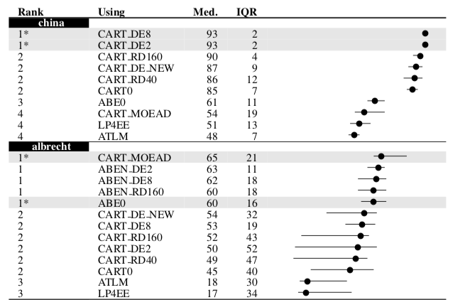

<a name=top>&nbsp;<p> </a>
[home](http://tiny.cc/ase19#top) | 
[copyright](https://github.com/txt/ase19/blob/master/LICENSE.md#top) &copy;2019, tjmenzie&commat;ncsu.edu 
<br> [](http://tiny.cc/ase19)<br> 
[syllabus](https://github.com/txt/ase19/blob/master/syllabus.md#top) | 
[src](http://menzies.us/fun) | 
[submit](http://tiny.cc/ase19give) | 
[chat](https://ase19.slack.com/) 


# Evalaution (101)

Sometimes you can achieve on one goal and fail on another.
So 

- not everything wins on every goal
- the goals we set determines the conclusions we condone.

But what are the goals often seen in practice?

## Cross-validation

Usual practice (strongly recommended) is the train on some data and test on some other.

- e.g. given a  data set, shuffle its order 5 times
  - each time, divide into 5 bins
  - train on four bins, test on the remaining
  - 25 repeated results
- e.g. given data divided into times T1, T2, T3,... (e.g. software relased as different versions)
  - train on the past (time T<sub>i</sub>) and test on the future (time T<sub>j&gt;i</sub>)

## Multiple Trials

For any algorithm with a stochastic component, it is got practice to repeat mulitple times,w ith different random seeds

- e.g. 20 repeats (if algorithm not too slow)
- strive for at least 10

## Comparing distributions


This means that when we compare different learners/ optimizers,w e are mot compare one value but rather ranges of values from each treatment.

For example, if our data came from normal bell shaped curves, we would apply statistical tests called [Hedges and ttests](http://menzies.us/fun/nums.html) to check the overlap between the curves

- and if that overlap was small, then we could say the distributions are different
- after which point, we can compare the median/mean values.

If doubt the normality assumption, then use tests that do not assume normal bell shaped curves like [Cliff's Delta and bootstrap](http://menzies.us/fun/sk.html). These are _sampling_
methods that draw values from one distributions, then see where these values fall in other distribution. 

## Numeric Goals

- residual = RE = predicted - actual
- magnitude of RE = MRE= abs(predicted - actual)
- PRED(N) = how may estimates are less than N
     - e.g. PRED(30) is standard (how many estimates within 30% of actual)
- medianRE = median of lots of RE
- meanRE = mean of lots of RE (not recommended)

Some argue that these numbers need to be baselined as a ratio against "do
the dumbest thing you can":

- let `y` = mean of the training set
-  let `x` = your numeric estimate from the more
- _Standardised accuracy_ = (1- x/y) * 100
    - Larger values are better



## Statistical Ranking

In the above diagram, the left-hand-side _rank_ column comes from statistical tests over each row.
After sorting on the median score, we compare row _i_ with _i+1_L

- Rows that are statistically indistinguishable  are ranked together,
- Otherwise, the rank of row _i+1_ is one plus the rank of the row before it.


This ranking trick is a great way to simplify reasoning about complex problems.  It turns out that many 
treatments have indistinguishable performance (to say that another way, data sneers at excessive cleverness).

- E.g. see figure 3c and 3d of [Yan et al.](https://xin-xia.github.io/publication/esem17.pdf)
where dozens of treatments form just 4-5  ranks.


## Discrete goals

(For code to implement the following, see [abcd](http://menzies.us/fun/abcd).

Consider the output stream,

```
%are you a dog?
 predicted truth
 --------- -----
 yes       no
 yes       yes
 no        no
 yes       yes
 no        no
 ...       ...
```
Note that sometimes `dog`s are correctly predicted and sometimes
they ain't (line one).

How do we convert these pairs into evaluation measures?

Discrete detectors can be assessed according to the following measures:

```
+-------------+------------+
|           truth          |
|     no            yes    |
+-------------+------------+
|      a      |      b     | classifer predicts = no
+-------------+------------+
|      c      |      d     | classifier predicts = yes
+-------------+------------+
```

- accuracy                   = acc          = (a+d)/(a+b+c+d
- probability of detection   = pd  = recall = d/(b+d)
- probability of false alarm = pf           = c/(a+c)
- precision                  = prec         = d/(c+d)
- distance2heaven            = d2h          = sqrt( (1-pd)^2 + pf^2 )
- pos/neg                    =              = (b+d) / (a+c)

(We'll use pos/neg later on, see below.)

```
 no,  yes,   <-- classified as
 120,  20,   no   
  20,  20,   yes
```

For more that two classes, need to build one table per class of
e.g. (a,nota), (b,notb), (c,notc) then report seperately for each.

```
 a,   b,    c,  <-- classifieed as
50,  10,    5,  a
 5,  80,   10,  b
20,  30,  100,  c
```

### Ideally...

Ideally, detectors have high PDs, low PFs, and low
 effort. This ideal state rarely happens:
 
- PD and effort are linked. The more modules that trigger
 the detector, the higher the PD. However, effort also gets
 increases
- High PD or low PF comes at the cost of high PF or low PD
(respectively). 

These links can be seen in a standard
receiver operator curve (ROC).  Suppose, for example, 
LOC&lt;x
is used as the detector (i.e. we assume large modules have
more errors). LOC&lt;x represents a family of detectors:

- At
x=0, EVERY module is predicted to have errors. This detector
has a high PD but also a high false alarm rate. 
- At x=0, NO
module is predicted to have errors. This detector has a low
false alarm rate but won't detect anything at all. At 0&lt;x&lt;1,
a set of detectors are generated as shown below:

```
        pd
      1 |           x  x  x     KEY:
        |        x     .         "."  denotes the line PD=PF
        |     x      .           "x"  denotes the roc curve 
        |   x      .                  for a set of detectors
        |  x     .
        | x    . 
        | x  .
        |x .
        |x
        x------------------ pf    
       0                   1
```

Note that:

- The only way to make no mistakes (PF=0) is to do nothing (PD=0)
- The only way to catch more detects is to make more
mistakes (increasing PD means increasing PF).
- Our detector bends towards the "sweet spot" of
<PD=1,PF=0> but does not reach it.
- The line pf=pd on the above graph represents the "no information"
line. If pf=pd then the detector is pretty useless. The better
the detector, the more it rises above PF=PD towards the "sweet spot".

For more on the connection of pd,pf,precision, etc, see
[Problems with Precision](http://menzies.us/pdf/07precision.pdf)
where it is derived that

```
pf = pos / neg * (1-prec)/prec * recall
```


## Evaluation measures for optimizers:

For single objective problems, measures such as absolute residual or rank-difference can be very useful but cannot be used for multi-objective problems. The following are the measures used for such problems. 

First, we need a _pareto frontier_ "_P_".

- The frontier are  the solutions that "dominate" the rest
  - Informally, the dominating solutions are those with a clear line of sight to heaven (the point of best goals)
  - More formally, for binary domination, 
    - _None worse_: X dominates Y if none of X's objectives are worst than in Y, 
    - _One better_: And at least one objective score in X is better than Y.
  - More formally, for indicator  domination, X dominates Y if we sum the difference in the goals, raised to some power.
    - see [RowDom](http://menzies.us/fun/row.html#scoring-rows).

Given multiple optimizers which achieved frontiers of A<sub>1</sub>, A<sub>2</sub>, ....

- the reference frontier is the dominating examples of _R=dom(&Union;A<sub>i</sub>)_ 
  -  i.e. you throw together all the A<sub>i</sub> together and discard anything worse than anything else.


- _Generational Distance:_ Generational distance is the measure of convergence: how close is the predicted Pareto front A<sub>i</sub> is to the actual Pareto front. 
It is defined to measure (using Euclidean distance) how far are the solutions that exist in _R_  to the nearest solutions in A<sub>i</sub>. 
   - In an ideal case, the GD is 0, which means the predicted fronter is a subset of the actual reference froniter. 
   - Note that GD ignores how well the solutions are spread out. 

_Spread:_ Spread is a measure of diversity—how well the solutions in A<sub>i</sub> are spread. This measure reports the gaps between nearest solutions on the froniter A<sub>i</sub>.
  - An ideal case is when the solutions in are spread evenly across the Predicted Pareto Front; i.e. there are no
    large gaps in the members of A<sub>i</sub>. 
  - So smaller values of Spread and better.

- _ Inverted Generational Distance:_ Inverted Generational distance measures both convergence as well as the diversity of the solutions—measures the shortest distance from each solution in the Actual frontier A<sub>i</sub> to the closest solution in _R_.  Like Generational distance, the distance is measured in Euclidean space. I
  - In an ideal case, IGD is 0, which means the predicted PF is same as the actual PF.

_Hypervolume:- Hypervolume measures both convergence as well as the diversity of the solutions— hypervolume is the union of the cuboids w.r.t. to a reference point. Note that the hypervolume implicitly defines an arbitrary aim of optimization. Also, it is not efficiently computable when the number of dimensions is large, however, approximations exist.
Approximation: Additive/multiplicative Approximation is an alternative measure which can be computed in linear time (w.r.t. to the number of objectives). It is the multi-objective extension of the concept of approximation encountered in theoretical computer science.

- And [many other ways](http://www.optimization-online.org/DB_FILE/2018/10/6887.pdf), as well.

<br clear=both>

## Special Measures for SE

Software engineering, we might have some other measures.

### IFA

In 2011,
[Parnin and Orso](https://www.cc.gatech.edu/home/orso/papers/parnin.orso.ISSTA11.pdf)
noted that developers are not using debugging tools since they
grow impatient when they generate false alarms. 

So one measure of success of a defect predictor is to minimize
`IFA` (see section V of [Supervised vs Unsupervised
Models: A Holistic Look at Effort-Aware Just-in-Time Defect
Prediction](https://xin-xia.github.io/publication/icsme173.pdf));
i.e.  number of initial false alarms encountered before we find the
first defect.

### Popt(20)

Another measure of success is "how little do you need to read to find
most bugs". The usual rule is you want find 20% of the code to find
80% of the defects.

For exaple, if we know how many locs of code are seen in the methods
in the above cells `a,b,c,d`, then we can define how many lines of
code we need to read to find the bugs (and our goal is read _less_
and find _more_ bugs):

- build a defect predictor
- find the code where the prediction = yes, no
- Build `S(m)` as follows: 
    - `tmp1` = sort the yes _ascending_ on lines of code
    - `S(m)` = sort the no _ascending_ on lines of code, append to `tmp1`
- Build `S(worst)` as follows:
    - `tmp2` = sort the yes _descending_ on lines of code
    - `S(worst)` = sort the no _descedning_ on lines of code, append to `tmp2`
- Build `S(optimial)` as follows:
    - Sort all code _descending_ on number of defects
- Walk the curves left to right, recording what defects we find
- `Popt = 1 - ( S(optimal) - S(m) ) / (S(optional) - S(worst) ) `
- Usually, we report the recall when Popt = 20%


### Multi-Obejctive Goals


Different business contexts need different goals.

So what we need are goal-aware learners.

End data mining.

Begin multi-objective optimization.


