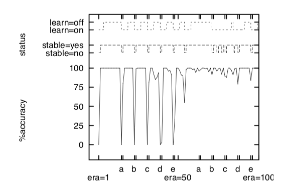

<a name=top>&nbsp;<p> </a>
[home](http://tiny.cc/ase19#top) | 
[copyright](https://github.com/txt/ase19/blob/master/LICENSE.md#top) &copy;2019, tjmenzie&commat;ncsu.edu 
<br> [](http://tiny.cc/ase19)<br> 
[syllabus](https://github.com/txt/ase19/blob/master/syllabus.md#top) | 
[src](http://menzies.us/fun) | 
[submit](http://tiny.cc/ase19give) | 
[chat](https://ase19.slack.com/) 


# Evaluation (abc)


Things to watch for:

-  at some point, the "verification" rig starts becoming the learner.
- Of the following, cross-val and round-robin and leave-one-out add extensively to the cost of validation.

## Cross-validation:

- M\*N cross-val: M times randomize order to data, divide into N bins
   - for each bin, test of this after training on that


- Why M random orderings?
    - order effects
    - Data where certain classes are ordered (e.g. all the men are listed at the end). Randomization ensures that the all the test wins have some test data.
-  If M=N=10 then training /test is now executed 100 times
- I never seen a case for  anything more than M=N=5 (so "only" 25 repeats)

## Leave-one-out.
- Repeat for every one example:
   - Train on all but one
   - Test on the remaining one
 - For a data set with 1000 examples, training now runs 1000 times.
  
## Round robin
- Data from N sources.
- Train on everyone else, test on me.
-  For N sources, train/test now repeat N times

## Temporal cross-val:
-   divide data by time (e.g. software has releases)
- train on before, test on the future
- For (e.g.) software data divided into 5 time slices, then train/test now repeated 5 times.
- A recent [best-paper award](http://www0.cs.ucl.ac.uk/staff/F.Sarro/resource/papers/FSE19Jimenez.pdf)  went to an FSE'19 paper that argues that temporal is far more insightful than standard cross-val
   - Be that as it may when data has no ordering information, you cannot do temporal

## Incremental verification:
- can be applied over a temporal ordering (if one is known)
- Or it could be run M times (were each time your randomize order of data)
- While true
     - read "era" number of rows
     - test that data using information from the last era.
     - Update model with data from that "era"
- If era size =1, lots of retraining
- Pro-tip:
     - Usually necessary: keep the test set the same size
         - so don't test on "everything  after here" since that changes in size
         - just test on the next (say) 1 era
     - Optional: keep the train set the same size
         - e.g. test on all the data from the last 6 months (rather than all the stuff from the
           last few  releases, which may arrive  at different times).

## Scott-Knot

If you do all the above for L different learners on D data sets you will now be facing L\*D\*M\*N results.
How to make sense of them all?

### Tip1: visualize

Look at the results. Get a sense of what is going on. Then apply statistical tests as a sanity check on your intuitions.

[Many ways to visual data.](https://www.tableau.com/learn/articles/books-about-data-visualization). We'll keep it simple.

```python
def xtile(lst,lo=The.lo,hi=The.hi,width=The.width,
             chops=[0.1 ,0.3,0.5,0.7,0.9],
             marks=["-" ," "," ","-"," "],
             bar="|",star="*",show=" %3.0f"):
  """The function _xtile_ takes a list of (possibly)
  unsorted numbers and presents them as a horizontal
  xtile chart (in ascii format). The default is a 
  contracted _quintile_ that shows the 
  10,30,50,70,90 breaks in the data (but this can be 
  changed- see the optional flags of the function).
  """
  def pos(p)   : return ordered[int(len(lst)*p)]
  def place(x) : 
    return int(width*float((x - lo))/(hi - lo+0.00001))
  def pretty(lst) : 
    return ', '.join([show % x for x in lst])
  ordered = sorted(lst)
  lo      = min(lo,ordered[0])
  hi      = max(hi,ordered[-1])
  what    = [pos(p)   for p in chops]
  where   = [place(n) for n in  what]
  out     = [" "] * width
  for one,two in pairs(where):
    for i in range(one,two): 
      out[i] = marks[0]
    marks = marks[1:]
  out[int(width/2)]    = bar
  out[place(pos(0.5))] = star 
  return '('+''.join(out) +  ")," +  pretty(what)
```

Demo

```
def _tile2():
  def show(lst):
    return xtile(lst,lo=0, hi=1,width=25,
		show= lambda s:" %3.2f" % s)
  print "one", show([0.21, 0.29, 0.28, 0.32, 0.32, 
		0.28, 0.29, 0.41, 0.42, 0.48])
  print "two", show([0.71, 0.92, 0.80, 0.79, 0.78, 
                     0.9,  0.71, 0.82, 0.79, 0.98])
```

Output:
```
   one         * --|            , 0.28,  0.29,  0.32,  0.41,  0.48
   two             |    -- * -- , 0.71,  0.79,  0.80,  0.90,  0.98
```

Note that using the above, we could present millions of numbers in dozens of treatments in just a page.
For example, here are seven data sets scored on three different criteria (where the above ascii
grapic has been turned into some pdf via some Latex magic). Note that all performances are sorted by
median value and "IQR" = 75th = 25th percentile.


### Tip2: CLuster the the results (Scott Knott)

Exmple: results from five treatments:

```
 x1  0.34  0.49  0.51  0.6
 x2  0.6   0.7   0.8   0.9
 x3  0.15  0.25  0.4   0.35 
 x4  0.6   0.7   0.8   0.9 
 x5  0.1   0.2   0.3   0.4
```

Step1: compute quartiles

```
RX   10 %   30 %   50 %   70 %   90 %
--   ----   ----   ----   ----   ----
x1 : 0.34,  0.49,  0.51,  0.51,  0.60
x2 : 0.60,  0.70,  0.80,  0.80,  0.90
x3 : 0.15,  0.25,  0.35,  0.35,  0.40
x4 : 0.60,  0.70,  0.80,  0.80,  0.90
x5 : 0.10,  0.20,  0.30,  0.30,  0.40
```

Step2: sort by median, add xtiles:
```
        50%        (75-25)%
        median     IQR
        ------     ----
x5 ,    0.3   ,    0.1  (---    *---    |              ), 0.10,  0.20,  0.30,  0.30,  0.40
x3 ,    0.35  ,    0.1  ( ----    *-    |              ), 0.15,  0.25,  0.35,  0.35,  0.40
x1 ,    0.51  ,    0.02 (        ------ *--            ), 0.34,  0.49,  0.51,  0.51,  0.60
x2 ,    0.8   ,    0.1  (               |  ----    *-- ), 0.60,  0.70,  0.80,  0.80,  0.90
x4 ,    0.8   ,    0,1  (               |  ----    *-- ), 0.60,  0.70,  0.80,  0.80,  0.90
```

Step 3: cluster similar results
```
                50%        (75-25)%
                median     IQR
                ------     ----
group1: x5 ,    0.3   ,    0.1  (---    *---    |              ), 0.10,  0.20,  0.30,  0.30,  0.40
group1: x3 ,    0.35  ,    0.1  ( ----    *-    |              ), 0.15,  0.25,  0.35,  0.35,  0.40
--------------------------------------------------------------------------------------------------
group2: x1 ,    0.51  ,    0.02 (        ------ *--            ), 0.34,  0.49,  0.51,  0.51,  0.60
--------------------------------------------------------------------------------------------------
group3: x2 ,    0.8   ,    0.1  (               |  ----    *-- ), 0.60,  0.70,  0.80,  0.80,  0.90
group3: x4 ,    0.8   ,    0,1  (               |  ----    *-- ), 0.60,  0.70,  0.80,  0.80,  0.90
```

How to compute "similar"?

- Scott-Knot test
- Sort treatments
- Recurisively divide that sort
  - Find the break that maximimzes the difference of the mean value before the break and the expected value of the mean 
    after the break
    - let the sort be divided into "l" (left) and "r" (right) of size "l.n" and "r.n" and means of "l.mu" and "r.mu"
    - the the mean and size before the break be "mu" and "n"
    - break at the point that maximizes: `l.n/n*(mu- l.mu)^2 + r.n/n*(mu- r.mu)^2`
  - Apply your favorite statistical test to check that "l" and "r" are truly different
  - If truly different, then recurse.

Common effect in Scott-Knot:

- Nature laughs at your cleveness
- Your supposedly more sophisticated approach... isn't

For example:

- Given a  large data set,
- An approximate kth-nearest neighbor grabs _sample_ number of random examples
- Then it selects the _k_ nearest using a distance function
  - D= (&sum; (x-y)<sup>p</sub>))<sup>1/p</sup>
- Then it smooths out its conclusions over those _k_ using some _kernal_ function
  - e,.g. median
  - e.g.  triangle (nearest thing counts 1, second counts half, third counts a third, etc)

But what to use for _k,p, samples, kernel_?
- lets try _k_ = 1,2,4,8
- samples = 32, 128, 256, 512
- kernel = tirangle, median
- p = 1,2,3,4
- performance measures = `abs(100*(predicted-actual)))`
  - so less is best

Pick the thing that 
is in the top rank. 
that runs fastest, 
that is simplest to implement,
- What do you see?

```
rank                                                  5     25     50     75     95   k  samples  p    kernel
    ----                                              -     –     –     –     –   -  -------  —  ------
    #1              -----      |                      0      3      7     13     23   4  512      4    triangle
                   * ----      |                      1      3      7     14     26   4  512      4    median
                   * ----      |                      1      3      7     14     26   1  512      4    triangle
                   * ----      |                      1      3      7     14     26   2  512      4    median
                   * ------    |                      1      3      7     15     31   4  512      2    median
                   * ------    |                      1      3      7     15     31   2  512      2    median
                   * ----      |                      1      3      7     14     26   1  512      2    triangle
                   * ----      |                      1      3      7     14     26   1  512      2    median
                   -----       |                      1      3      7     13     25   4  512      2    triangle
                 - * -----     |                      1      4      7     13     27   4  128      2    triangle
                 - -----       |                      1      3      7     12     24   8  256      2    triangle
                 - ------      |                      1      4      7     13     27   8  256      4    triangle
                   ----        |                      1      3      7     13     22   8  512      2    triangle
                   * -----     |                      1      3      7     14     28   2  512      2    triangle
                 - -----       |                      1      4      7     12     25   4  256      2    triangle
                 - * ------    |                      0      4      7     14     30   4  128      4    triangle
                 - * ----      |                      1      3      7     14     26   8  128      2    triangle
                   * -----     |                      1      3      7     14     28   2  512      4    triangle
                   *-----      |                      0      3      7     13     25   8  512      4    triangle
                   * -----     |                      0      3      7     14     28   2  256      2    triangle
                   * -----     |                      1      3      8     14     28   2  256      4    triangle
                 - * -----     |                      1      4      8     13     27   4  256      4    triangle
                 - * ------    |                      1      4      8     15     31   4  512      3    triangle
                 - * -----     |                      1      4      8     15     28   2  128      4    triangle
                   * -----     |                      1      3      8     15     29   1  256      2    median
                   * ------    |                      1      3      8     15     31   1  512      4    median
                   * -----     |                      0      3      8     15     28   2  128      4    median
                   * ------    |                      1      3      8     14     31   1  256      2    triangle
                   * ----      |                      1      3      8     15     26   1  256      4    median
                   * -------   |                      1      3      8     16     33   1  128      2    median
                   * ------    |                      1      3      8     15     31   2  256      4    median
                 - * -----     |                      1      3      8     14     28   2  128      2    triangle
                   * ------    |                      0      3      8     15     31   1  256      4    triangle
                   * ------    |                      1      3      8     16     32   1  128      4    triangle
                 - * -----     |                      1      4      8     15     28   8  128      4    triangle
                 - * ------    |                      1      4      8     16     33   8  256      3    triangle
                 - *  -------  |                      1      4      8     17     37   2  256      3    triangle
                 - * -------   |                      1      4      9     16     35   4  256      3    triangle
                 - * -------   |                      1      4      9     16     35   4  32       2    triangle
                 - *  -----    |                      1      4      9     17     32   8  32       2    triangle
                 - *  -----    |                      1      4      9     18     33   2  32       4    triangle
                 - * ------    |                      1      4      9     15     31   4  256      2    median
                 - * ------    |                      1      4      9     16     32   1  128      2    triangle
                   * ------    |                      1      3      9     15     30   4  256      4    median
                   * -----     |                      1      3      9     15     28   2  256      2    median
                 - * -------   |                      1      4      9     16     35   2  512      3    triangle
                   * ------    |                      1      3      9     15     32   2  128      2    median
                   * ------    |                      1      3      9     16     31   1  128      4    median
                   * -------   |                      1      3      9     16     33   8  512      4    median
--------------------------------------------------------------------------------------------------------------
    #2           - *  -------  |                      1      4      9     17     38   4  512      3    median
                 - *  ------   |                      1      4      9     17     35   2  32       2    median
                 - *  ------   |                      1      4      9     17     35   1  512      3    triangle
                 - *  -------  |                      1      4      9     18     37   1  256      3    triangle
                 - * -------   |                      1      4      9     16     34   8  512      3    triangle
                 - *  -------  |                      1      4      9     18     39   4  128      3    triangle
                 - *  -----    |                      1      4      9     17     33   8  32       4    triangle
                 - * ------    |                      1      4      9     16     32   2  32       2    triangle
                 - *  -------  |                      1      5      9     19     39   8  128      3    triangle
                 - *   --------|                      1      5     10     20     45   2  128      3    triangle
                 - * -------   |                      1      4     10     16     34   4  32       4    triangle
                 -  * -------- |                      1      5     10     19     40   1  32       4    median
                 -  * ------   |                      1      4     10     17     35   2  512      3    median
                 -  * ------   |                      1      4     10     17     35   1  512      3    median
                 -  * -------  |                      1      4     10     18     37   1  256      3    median
                 -  * -----    |                      1      4     10     17     30   4  128      2    median
                 -  * -------  |                      1      4     10     19     38   1  32       2    triangle
                 -  * ------   |                      1      4     10     17     35   8  256      4    median
                 -  *  ------  |                      1      4     10     20     39   1  32       2    median
                 -  *  ------- |                      1      5     11     20     41   4  256      3    median
                 -  * -------  |                      1      4     11     18     39   1  128      3    triangle
                 -  *  ------- |                      1      6     11     20     41   4  32       4    median
                 -  * ------   |                      1      4     11     18     36   4  128      4    median
                 -  *  ------  |                      1      5     11     20     39   2  32       4    median
                 -  * -------  |                      1      4     11     19     39   1  32       4    triangle
                 -  *  ------- |                      1      4     11     20     42   1  128      3    median
                 -  *  --------|                      1      5     11     20     44   2  128      3    median
                 -  *  ------  |                      1      5     11     20     38   8  128      4    median
                 -  *  ------- |                      1      5     11     21     40   8  128      2    median
--------------------------------------------------------------------------------------------------------------
    #3           -  *   -------|–                     1      5     12     26     55   1  32       3    triangle
                 -  *  --------|                      2      6     12     22     45   4  32       2    median
                 -  *  --------|                      1      5     12     22     44   8  512      3    median
                 -  *  --------|                      1      6     12     21     48   4  128      3    median
                 -  *  --------|                      2      6     12     21     44   8  32       2    median
                 -  *  --------|                      1      6     12     23     43   4  32       3    triangle
                 -  *   -------|                      1      6     13     26     49   4  256      1    triangle
                 -  *  --------|                      1      5     13     23     49   8  256      3    median
                 -  *   -------|                      1      6     13     26     49   1  128      1    median
                 -  *   -------|-                     1      6     13     24     51   2  32       3    median
                 -  *   -------|-                     1      6     13     26     52   8  128      3    median
                 -  *    ------|–                     1      6     13     27     55   2  256      1    median
                 -  *    ------|–                     1      6     13     28     55   4  512      1    median
                 -  *    ------|—                     1      6     13     28     57   8  256      1    median
                 -  *   -------|-                     1      6     13     24     53   2  32       3    triangle
                 -  *    ------|----                  1      6     13     28     62   4  256      1    median
                 -  *   -------|-                     1      6     13     24     50   8  512      1    triangle
                 -  *   -------|                      1      5     13     25     45   8  256      1    triangle
                 -   *  -------|—                     1      6     13     26     57   2  256      1    triangle
                  –  *  -------|                      1      7     14     25     46   8  32       3    triangle
                 -   *   ------|-                     1      6     14     28     51   2  512      1    triangle
                 -   *  -------|                      1      6     14     25     47   4  128      1    triangle
             i     –  *  -------|                      1      7     14     24     47   8  128      1    triangle
                 -   *  -------|                      1      6     14     25     49   4  512      1    triangle
                 -   *  -------|–                     1      6     14     26     53   2  32       1    triangle
                 -   *  -------|-                     1      6     14     26     50   1  512      1    triangle
                 -   *  -------|                      1      6     14     25     46   8  32       4    median
                 -   *  -------|----                  1      6     14     26     62   8  512      1    median
                 -   *   ------|—                     1      6     14     28     59   1  128      1    triangle
                 -   *   ------|----                  1      6     14     28     62   4  128      1    median
                 -   *    -----|----                  1      6     14     30     60   8  128      1    median
                 –  *   ------|—                      1      7     14     27     59   1  32       3    median
                 –  *   ------|—                      1      7     14     26     57   2  128      1    triangle
                 –  *   ------|–                      1      7     15     29     53   1  32       1    triangle
                 -   *    -----|—                     2      6     15     30     57   1  256      1    median
                 -   *    -----|–                     2      6     15     30     53   2  512      1    median
                 -   *   ------|                      1      6     15     27     49   4  32       1    triangle
                 –  *   ------|                       1      8     16     29     49   8  32       1    triangle
                 –  *   ------|-                      1      8     16     28     51   1  512      1    median
                 –  *    -----|—                      1      7     16     31     58   1  256      1    triangle
                 –  *   ------|-                      1      7     16     28     52   2  128      1    median
                 –  *    -----|—                      1      7     16     31     58   1  32       1    median
                 –  *    -----|—                      1      8     16     32     59   2  32       1    median
                 –   *    ----|-----                  1      8     17     34     63   4  32       1    median
--------------------------------------------------------------------------------------------------------------
    #4           –   *    ----|----                   2      7     17     34     62   4  32       3    median
                 –   *     —|------                   2      9     19     39     69   8  32       1    median
                 —   *     –|-------                  3     10     22     41     71   8  32       3    median
```
## From "verification" to "inference"


### Example1: from cross-validation to bagging

- After a decade of using cross-validation to test learners, researchers stated to notice that they're learning more from N models (build via cross-validation) than from any single model
	- For a decade, the top 10 entries in the annual Netflix challenge (or predicting what the users will order next) used ensembles
- Bagging means divide the data up and learn different model from each each. This produces an "ensemble" of experts where the conclusions reached are derived from voting across the ensemble. 
    - There are many different voting schemes. Suggest you start with majority vote (for classifiers) or mean prediction (for regressors).
 - Bagging is an antidote to learners that assume "one size fits all"
 -   Bagging counteracts an inappropriate simplicity bias by shifting the model to a more complex form.    


### Example2: from incremental verification to incremental learning:

- If era size smaller than the time it takes from the data generating phenomena to change, incremental validation can drive a learner:
    - if performance of era I+1 same as I
         - forget the new model learned from era I
    - else
         - cache the old model,
         - look for a better model
                - amongst the old cached models
                - or amongst the data from learned from the current era
      - This is a useful approach if your are modeling something cyclic (e.g. weekend, weekday, weekend, weekday, etc). Can find repeated patterns in past data.
  

 
### Example3: from  incremental verification to incremental learning

- There is a class of expectation/minimization algorithms that make guesses
about the data (the "E" step) then take action to reduce the errors associated with those guesses (the "M" step). 
     - Note that such EM algorithms use verification as a sub-routine to improve their models as they go
- For example, K-means is a kind of EM algorithm,
       
     In its "E" step, centroids are initially assigned at random then all examples are labelled according to their nearest centroid. In the "M" step, the error in the guess about the centroid is corrected by moving the centroid to the middle of the examples labelled with the same centroid. Then we just repeat till the centroids stop moving much.
           - Note that K-means can be improved via a good choice of initial centroids.
              There are some very simple, and effective, ways to make that choice such as K-means++ (k-times, [pick a centre stochastically favoring points that are furthest from their nearest centroid](https://rosettacode.org/wiki/K-means%2B%2B_clustering#Python)
- Now K-means is a hack-- a grand and glorious and very useful hack, to be sure, but a hack never the less. To see the general form of EM in all its mathematical glory, [see p6 of this doc](https://www.math.univ-toulouse.fr/~besse/Wikistat/pdf/st-m-datSc4-EMmixt.pdf). The thing to note here is that this more general EM algorithm is not just for clustering but is more broadly applicable.    

### Example4: from incremental verification to scalable incremental clustering

- For scaling to very large data sets, we make   a grand and glorious hack to the grand and glorious K-means hack.
- [Mini-batch K-means](https://www.eecs.tufts.edu/~dsculley/papers/fastkmeans.pdf) reads the data in eras (called "batches") of size "_b_". 
   - As with K-means, we label each arriving example with the id of its nearest sample (and initially, we pick those centroids at random). By the way, this is analogous to the  "E" step
   - For the "M" step, we assume that the more examples a centroid has seen, the
      More we believe in it and the less we want to move it 
    - "n" stores how often this centroid has been picked by new data
    - So in the "E" step, each item "pulls" its centroid  attribute "c" towards its own attribute "x"  by an amount weighted   `c = (1-1/n)*c + x/n`. 
    - Note that when "n" is large, "c" barely moves at all.

### Example 5: Boosting from incremental verification to better learners

- Boosting builds a classifier using examples selected from the data at probability "p"
- examples that are misclassified get weighted higher
- So In the next round, a new classifier is built that focuses on the examples found most problematic the round before
- So boosting is like building something fromIkea. Bunch of experts that focus in on the harder and harder problems.
- The final conclusion is a weighed sum across the ensemble of boosted classifiers.


