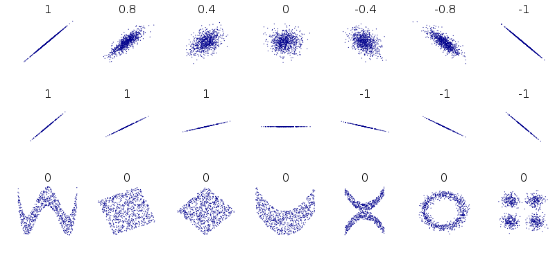

<a name=top>&nbsp;<p> </a>
[home](http://tiny.cc/ase19#top) | 
[copyright](https://github.com/txt/ase19/blob/master/LICENSE.md#top) &copy;2019, tjmenzie&commat;ncsu.edu 
<br> [](http://tiny.cc/ase19)<br> 
[syllabus](https://github.com/txt/ase19/blob/master/syllabus.md#top) | 
[src](http://menzies.us/fun) | 
[submit](http://tiny.cc/ase19give) | 
[chat](https://ase19.slack.com/) 

#  LSR = Least Squares Regression

One of the most basic data mining algorithms is least squares
regression.  This algorithm tries to fit a straight line to a set
of points. The best line is the one that reduces the square of the
distance between the predicted and actual values.


First, we'll do the simple case

- Two-dimensional LSR (just `x` versus `y`)
- y= &beta;x + &alpha;

Or, in Python

```python
def predict(alpha, beta, x_i): return beta * x_i + alpha
```

Given a prediction `y_i`, then its error 
and sum of errors squared is:

```python
def error(alpha, beta, x_i, y_i):
  return y_i - predict(alpha, beta, x_i)

def sum_of_squared_errors(alpha, beta, x, y):
    return sum(error(alpha, beta, x_i, y_i) ** 2
               for x_i, y_i in zip(x, y))
```

The &alpha; and &beta; terms can be computed from the standard
deviation and correlation and covariance. Covariance is like a
two-dimensional version of variance.  Whereas variance measures how
much values change from the mean, measures how two variables vary
in tandem from their means.

```python
def covariance(x, y):
  n = len(x)
  return dot(de_mean(x), de_mean(y)) / (n - 1)

def de_mean(x):
  """translate x by subtracting its mean 
     (so the result has mean 0)"""
  x_bar = mean(x)
  return [x_i - x_bar for x_i in x]

def mean(x)          : return sum(x) / len(x)
def sum_of_squares(v): return dot(v, v)
def dot(v, w)        : return sum(v_i * w_i for v_i, w_i in zip(v, w))
```

Correlation is a  number that varies 

- -1 to 0 to 1 ;
- where -1 means perfectly negatively associated;
- and 0 means random connection;
- and 1 means perfectly associated.

 

```python
def correlation(x, y):
  stdev_x = standard_deviation(x)
  stdev_y = standard_deviation(y)
  if stdev_x > 0 and stdev_y > 0:
    return covariance(x, y) / stdev_x / stdev_y
  else:
    return 0 # if no variation, correlation is zero

def standard_deviation(x):
  return math.sqrt(variance(x))

def variance(x):
  n = len(x)
  deviations = de_mean(x)
  return sum_of_squares(deviations) / (n - 1)
```

And finally:

```python
def least_squares_fit(x,y):
  beta = correlation(x, y) * standard_deviation(y) / standard_deviation(x)
  alpha = mean(y) - beta * mean(x)
  return alpha, beta
```

For example:

```
num_friends = [ 100, 49, 41, 40, 25, 21, 21, 19, 19, 18, 18, 16,
15, 15, 15, 15, 14, 14, 13, 13, 13, 13, 12, 12, 11, 10, 10, 10, 10,
10, 10, 10, 10, 10, 10, 10, 10, 10, 10, 10, 9, 9, 9, 9, 9, 9, 9 ,
9, 9, 9, 9, 9, 9, 9, 9, 9, 9, 9, 8, 8, 8, 8, 8, 8, 8, 8, 8, 8, 8,
8, 8, 7, 7, 7, 7, 7, 7, 7, 7, 7, 7, 7, 7, 7, 7, 7, 6, 6, 6, 6, 6,
6, 6, 6, 6, 6, 6, 6, 6, 6, 6, 6, 6, 6, 6, 6, 6, 6, 5, 5, 5, 5, 5,
5 , 5, 5, 5, 5, 5, 5, 5, 5, 5, 4, 4, 4, 4, 4, 4, 4, 4, 4, 4, 4, 4,
4, 4, 4, 4, 4, 4, 4, 4, 3, 3, 3, 3, 3, 3, 3, 3, 3, 3, 3, 3, 3, 3,
3, 3, 3, 3, 3, 3, 2, 2, 2, 2, 2, 2, 2, 2, 2, 2, 2, 2, 2, 2, 2, 2,
2, 1, 1, 1, 1, 1, 1, 1, 1, 1, 1, 1, 1, 1, 1, 1, 1, 1, 1, 1, 1, 1,
1]

daily_minutes = [ 1, 68.77, 51.25, 52.08, 38.36, 44.54, 57.13, 51.4,
41.42, 31.22, 34.76, 54.01, 38.79, 47.59, 49.1, 27.66, 41.03, 36.73,
48.65, 28.12, 46.62, 35.57, 32.98, 35, 26.07, 23.77, 39.73, 40.57,
31.65, 31.21, 36.32, 20.45, 21.93, 26.02, 27.34, 23.49, 46.94, 30.5,
33.8,  24.23, 21.4, 27.94, 32.24, 40.57, 25.07, 19.42, 22.39, 18.42,
46.96, 23.72, 26.41, 26.97, 36.76, 40.32, 35.02, 29.47, 30.2, 31,
38.11, 38.18, 36.31, 21.03, 30.86, 36.07, 28.66, 29.08, 37.28,
15.28, 24.17, 22.31, 30.17, 25.53, 19.85, 35.37, 44.6, 17.23, 13.47,
26.33, 35.02, 32.09, 24.81, 19.33, 28.77, 24.26, 31.98, 25.73,
24.86, 16.28, 34.51, 15.23, 39.72, 40.8, 26.06, 35.76, 34.76, 16.13,
44.04, 18.03, 19.65, 32.62, 35.59, 39.43, 14.18, 35.24, 40.13,
41.82, 35.45, 36.07, 43.67, 24.61, 20.9, 21.9, 18.79, 27.61, 27.21,
26.61, 29.77, 20.59, 27.53, 13.82, 33.2, 25, 33.1, 36.65, 18.63,
14.87, 22.2, 36.81, 25.53, 24.62, 26.25, 18.21, 28.08, 19.42, 29.79,
32.8, 35.99, 28.32, 27.79, 35.88, 29.06, 36.28, 14.1, 36.63, 37.49,
26.9, 18.58, 38.48, 24.48, 18.95, 33.55, 14.24, 29.04, 32.51, 25.63,
22.22, 19, 32.73, 15.16, 13.9, 27.2, 32.01, 29.27, 33, 13.74, 20.42,
27.32, 18.23, 35.35, 28.48, 9.08, 24.62, 20.12, 35.26, 19.92, 31.02,
16.49, 12.16, 30.7, 31.22, 34.65, 13.13, 27.51, 33.2, 31.57, 14.1,
33.42, 17.44, 10.12, 24.42, 9.82, 23.39, 30.93, 15.03, 21.67, 31.09,
33.29, 22.61, 26.89, 23.48, 8.38, 27.81, 32.35, 23.84]

if __name__ == '__main__':
  print("variance(num_friends)", variance(num_friends))
  print("standard_deviation(num_friends)",
        standard_deviation(num_friends))
  print("covariance(num_friends, daily_minutes)",
        covariance(num_friends, daily_minutes))
  print("correlation(num_friends, daily_minutes)",
        correlation(num_friends, daily_minutes))
  print("alpha beta", least_squares_fit(num_friends, daily_minutes)) 
```

The output is:

```
variance(num_friends)	 81
standard_deviation(num_friends)	9.0
covariance(num_friends, daily_minutes)	22.425435139573054
correlation(num_friends, daily_minutes)	0.24819811705923378
alpha beta	(23.84486298346584, 0.8864062515241665)
```

That is, for the above data

- y =  0.88x + 23.8
- and the correlation is 0.25 (which is barely correlated at all).


