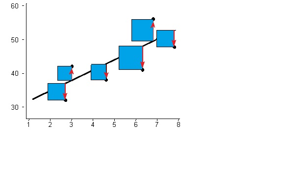

<a name=top>&nbsp;
 </a>
[home](http://tiny.cc/ase19#top) | 
[copyright](https://github.com/txt/ase19/blob/master/LICENSE.md#top) &copy;2019, tjmenzie&commat;ncsu.edu 
    
[syllabus](https://github.com/txt/ase19/blob/master/syllabus.md#top) | 
[src](http://menzies.us/fun) | 
[submit](http://tiny.cc/ase19give) | 
[chat](https://ase19.slack.com/) 

#  LSR = Least Squares Regression

One of the most basic data mining algorithms is least squares
regression.  This algorithm tries to fit a straight line to a set
of points. The best line is the one that reduces the square of the
distance between the predicted and actual values.

The 
