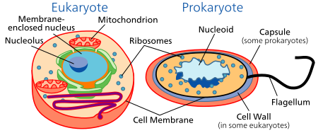
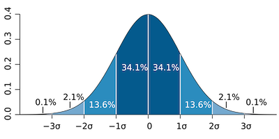

<a name=top>&nbsp;<p> </a>
[home](http://tiny.cc/ase19#top) | 
[copyright](https://github.com/txt/ase19/blob/master/LICENSE.md#top) &copy;2019, tjmenzie&commat;ncsu.edu 
<br> [](http://tiny.cc/ase19)<br> 
[syllabus](https://github.com/txt/ase19/blob/master/syllabus.md#top) | 
[src](http://menzies.us/fun) | 
[submit](http://tiny.cc/ase19give) | 
[chat](https://ase19.slack.com/) 


#   Optimization

Having read [lst](lsr.md), we have some idea how data miners can find the structure within data.
How is that different to Optimizers? Well:

- Data miners report "what is"
- Optimizers report "what to do",  in order to reach some goal.

Optimization is a process that happens all the time;

-  Here's a little video show how life optimizes to make more life. 
   [](https://www.youtube.com/watch?v=plVk4NVIUh8)
- In the video, bands of antibiotics of increasing concentration are 
  smeared across a large plate of bug food (4 feet long, 2 feet wide).
- E.coli (which are little bugs) are added to the two end zones 
  (that have no antibiotics),
- In a matter of days, these bugs learn how to grow even in the 
  presence of massive amounts of antibiotics.

How do they do this? Well,
all
need 
is a _jiggler_ and a _selector_ and enough time to

1. jiggle some stuff, 
2. select the better stuff, 
3. go to 1

For the E.coli in the video,
bugs are _selected _to make more bugs if they are
not killed by some antibiotic. 
As to the jiggling: 

- E.coli are what's know as prokaryotic cells 
- Prokaryotes have no internal membrane-bounded organelles; 
  i.e. very little internal structure.  For the most part,  
  they are just mostly  bags of water containing floating strands of DNA 
- At the start of this video, all the bacteria are just a little bit different (due to random mutations, which occur once [every .4 to 170 hours](https://www.ncbi.nlm.nih.gov/pmc/articles/PMC33863/))
- Later on, when two prokaryotes rub into each each other, they exchange material 
  just by mixing the floating bits (and 
  [a few other tricks](https://www.khanacademy.org/science/biology/bacteria-archaea/prokaryote-structure/a/genetic-variation-in-prokaryotes).  
- That means that as E.coli grow across the agar plate in the above 
  video, they keep exchanging genetic material with the other bugs 
  that they meet along the way.
- So its like the agar plate is a big blender that
  keeps mixing and matching all the different bits of all the different bugs.
- If any of the bugs get lucky, and learn how to handle more antibiotics, those bugs move into a new band (where there is less competition for food).  Hence, the new band gets full of bugs
  that can better handle that higher level of antibiotic.



(Just so you know, everything that is alive and big enough to be
seen with the naked eye, including you,  has "eukaryote" cells.
Such  cells are more structured and include nucleus and varying
organelles including, something called
[mitochondria](https://en.wikipedia.org/wiki/Mitochondrion)-- which
give eukaryotes  the extra juice they need to build large structures,
and run them around, quickly. You should not be too proud about
being a eukaryote--  they are the least successful way to organizing
living things.  For example, in marine environments, the prokaryotes
add up to [six times the mass of the larger eukaryotic
organisms](https://www.ncbi.nlm.nih.gov/pmc/articles/PMC33863/).)


## Software Optimizers

Here's a very simple optimizer that explores:

- _model1_ : which  we use to find what `x` values lead to better `y` values. In this example "better" means "smaller".
- _model2_ : which we use to guess better values for the `b` setting within the model. It turns out that _b=2_ is
  the right value, but the optimizer does not know that until it plays around a little.

```python
e=2.718281828459045

def model1(x, b=2):
  "just some function that weweeed to minimize"
  return e**(-(x-b)**2) + 0.8 * e**(-(x+b)**2)

def model2(b):
   "trying to guess b to best fit model to data"
   data=[ # data generated using b=2
          (-4.5, 0.01) ,(  -4, 0.04) ,(-3.5, 0.14) ,(  -3, 0.37) ,(-2.5, 0.66) 
         ,(  -2, 0.80) ,(-1.5, 0.66) ,( -1,  0.37) ,(-0.5, 0.15) ,(   0, 0.08) 
         ,( 0.5, 0.18) ,(   1, 0.46) ,( 1.5, 0.82) ,(   2, 1.00) ,( 2.5, 0.82) 
         ,(   3, 0.46) ,( 3.5, 0.17) ,(   4, 0.05) ,( 4.5, 0.01) ]
   err=0
   for x,actual in data:
     predict = model1(x,b)
     err    += abs(predict - actual)
   return err
```

 To `jiggle`,
we sample from a standard normal bell-shaped distribution (also
called the unit normal or the Z-curve).  Such a distribution has a
 mean of `mu=0` and a standard deviation of `sd=1`.
<br clear=both>

```python
import math random
r = random.random

def z():
  return math.sqrt(-2*math.log(r()))*math.cos(2*math.pi*r())
```

Next, we use a `Num` class that knows how to accept initial values for `mu,sd`. 
With that class, we can `jiggle` by pull values across the normal bell curve.

```python
class Num:
  def __init__(i,inits=[],mu=0, sd=1):
    # all the usual initializations
    i.mu, i.sd = mu.sd
    [i + x for x in inits]
  def any(i):
    "pull a random number from this distribution"
    return i.mu + i.sd * z()
  # all the other methods

def optimize(f       = model1,
             epsilon = 0.0000001,
             budget  = 10**4,
             samples = 100
             best    = 10,
             mu      = 0,
             sd      = 100):
  dist = Num(mu=mu, sd=sd)
  while True:
    xs = [ dist.any() 
          for _ in range(samples)] # jiggle
    ys = [ f(x) for x in xs ]      # score
    budget -= samples              # track how many times we called the model
    ys  = sorted(ys)[:best]        # select "best" smallest values
    dist = Num( ys )               # get set for more jiggling
    if dist.sd > epsilon: break
    if budget  < 0      : break
  return dist.mu
```

Note the `select` step in the above (we keep the `best` smallest values). This
is used to train a new distribution, which sets us up for more `jiggling`, and so on.


- 

## GA
- An EO procedure does not usually use gradient information in its
search process. Thus, EO methodologies are direct search procedures,
allowing them to be applied to a wide variety of optimization
problems.

- An EO procedure uses more than one solution (a population approach)
in an iteration, unlike in most classical optimization algorithms
which updates one solution in each iteration (a point approach).
The use of a population has a number of advantages: (i) it provides
an EO with a parallel processing power achieving a computationally
quick overall search, (ii) it allows an EO to find multiple optimal
solutions, thereby facilitating the solution of multi-modal and
multi-objective optimization problems, and (iii) it provides an EO
with the ability to normalize decision variables (as well as objective
and constraint functions) within an evolving population using the
population-best minimum and maximum values.

- An EO procedure uses stochastic operators, unlike deterministic
operators used in most classical optimization methods. The operators
tend to achieve a desired effect by using higher probabilities
towards desirable outcomes, as opposed to using predetermined and
fixed transition rules. This allows an EO algorithm to negotiate
multiple optima and other complexities better and provide them with
a global perspective in their search.


1. **Start:** Generate random population of n chromosomes (suitable solutions for the problem)
2. **Fitness:** Evaluate the fitness f(x) of each chromosome x in the population
3. **New population:** Create a new population by repeating following steps until the new population is complete
  - **Selection:** Select two parent chromosomes from a population according to their fitness (the better fitness, the bigger chance to be selected)
  - **Crossover:** With a crossover probability cross over the parents to form a new offspring (children). If no crossover was performed, offspring is an exact copy of parents.
  - **Mutation:** With a mutation probability mutate new offspring at each locus (position in chromosome).
  - **Accepting:** Place new offspring in a new population
4. **Replace:** Use new generated population for a further run of algorithm
5. **Test:** If the end condition is satisfied, stop, and return the best solution in current population
6. **Loop:** Go to step 2


Examples:
