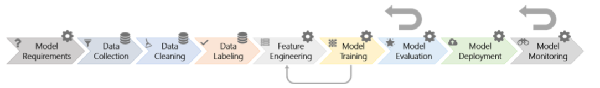
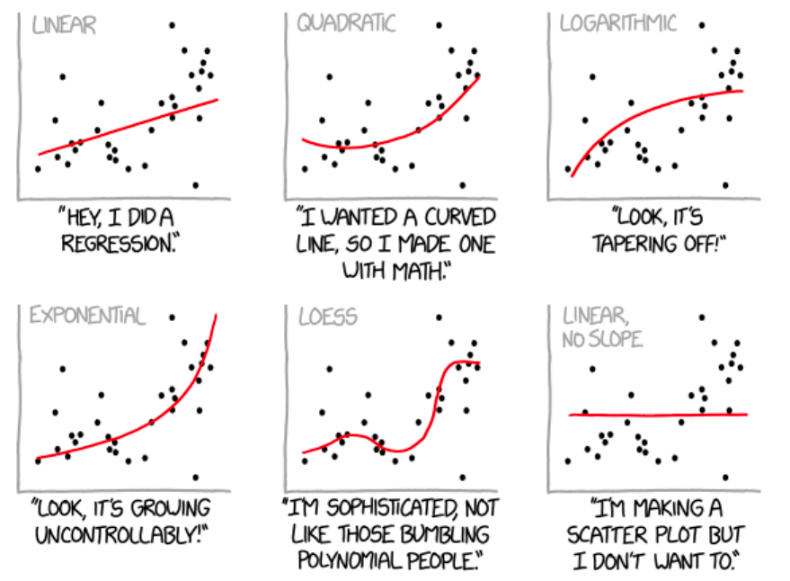
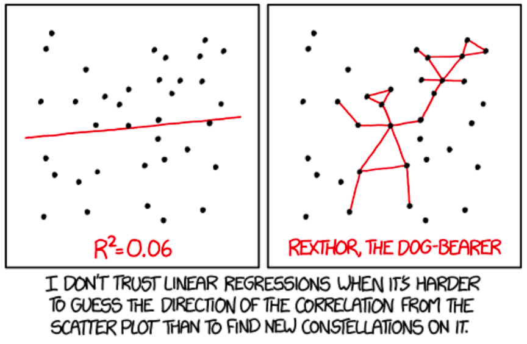
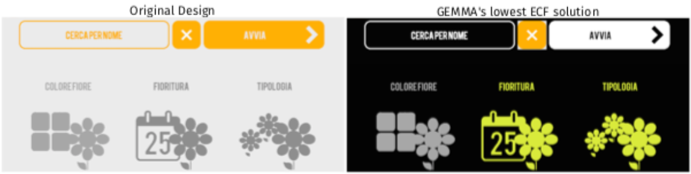
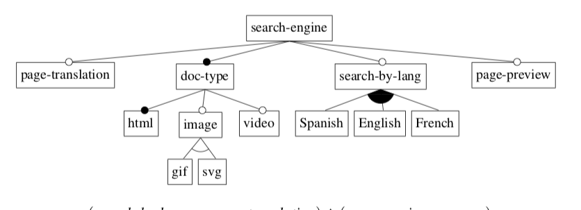

<a name=top>&nbsp;
 </a>
[home](http://tiny.cc/ase19#top) | 
[copyright](https://github.com/txt/ase19/blob/master/LICENSE.md#top) &copy;2019, tjmenzie&commat;ncsu.edu 
    
[syllabus](https://github.com/txt/ase19/blob/master/syllabus.md#top) | 
[src](http://menzies.us/fun) | 
[submit](http://tiny.cc/ase19give) | 
[chat](https://ase19.slack.com/) 

# Overview

This book is about using better software engineering to build better AI software.
 AI is a very broad topic, discussed in
 [so](REFS.md#norvig-2009)
 [very](REFS.md#grus--2019)
 [many](REFS.md#duda-2000)
 [other](REFS.md#witten-2016)
 books. So what makes this book so different?

## Process

The first way this book is unique is that
the authors of this book have spent decades applying many
AI tools (mostly  for software engineering applications). We share
some of that case study experience in this book. For example,
recently we
[reversed engineered from multiple AI applications](REFS.md#amershi-2019)
a nine-step
industrial AI pipeline. This book devoted nine chapters to that pipeline:

## Ethically-aligned Design

Secondly, when we say "build better AI", then by
"better"
we mean "ethically-aligned".
We assert that the design goals for SE-for-AI must be
prioritize for human well-being.

- It is ethical to improve
the profits of your company since that money becomes wages which
becomes groceries which becomes dinner so everyone and their kids
can sleep better at night.
- It is also ethical to change the design
of AI software in order to ensure   that (say) the software is not
unduly discriminatory towards a particular social group (e.g. some
groups characterized by age, race, or gender).

As discussed below,
AI tools offer us more
choices. This means that they
also offer us more ethical choices.
Better yet, AI also gives us methods
for automatically tracking down  what choices are useful
we want within a very large space of possibilities.
That is, once we tell AI that we want our systems to achieve ethical goals then:

- <em> AI tools lets us be more ethical than ever before.</em>
- But only if we first accept the merits
  and methods of an ethical approach.

So we suggest to you that when you start a new AI project:

- Your  first question should **not** be (e.g.) "what data miners should I apply to this data?".
- Rather, it should be  "what are the ethical requirements of this development? And how can we best support those requirements?".

Like it or not, ethics is now a primary design problem for AI systems,
perhaps because of so many examples of ethical issues with AI:

- One older version of a [sentiment analyzer from Google](REFS.md#Google-2017) gave negative (and wildly
inappropriate) scores to sentences like
"I am a Jew" and "I am homosexual".
- A popular photo tagging app assigned [animal category labels](REFS.md#Google_Photo) to dark skinned people.
- Recidivism assessment models predict who might commit crimes, in the future. Some such models used by the criminal justice system are more likely to
[falsely label black defendants as future criminals](REFS.md#Machine_Bias) (at twice the rate as white defendants).
- Facial recognition software which predicts characteristics such as gender, age from images has been found to have a
[much higher error rate](REFS.md#skin-bias-2018) for dark-skinned women compared to light-skinned men
- Amazon.com stopped using automated recruiting tools after finding [anti-women bias](REFS.md#Amazon_Bias).

In response,  many high-profile organizations 
have  discussed general principles for implementing autonomous and intelligent systems (A/IS).
including:

-  [Microsoft](REFS.md#microai-2019)
-  the  [Institute for Electronics and Electrical Engineers](REFS.md#IEEEethics-2019)
-  and the [European Commsion High-Level Expert Group on AI](REFS.md#euroethics-2018)

Now you might say that "I'm an engineer, ethics is not my department". But
it turns out that even in our day to day work, software engineers
make numerous choices with ethical implications.
The following list comes from
[Aydemir et al.](REFS.md#aydemir-2018):

- _Privacy_: Handling, storing, sharing user data only under the circumstances and for the purposes that the user sets
- _Sustainability_: Energy consumption of the software artifact, caring about energy throughout the SE process and in the documentation
- _Transparency_: Transparent decision-making procedures of intelligent systems, publicly available ethics policies by software development organizations
- _Diversity_: Gender, race, and age distribution of professionals in a development team
- _Work ethics_: Decisions on which bugs to fix and how quickly, ensuring quality of the code before release
- _Business ethics_: Informing users of a changed business model, including revenue models
- _Accountability_: Who should be held responsible for the harm caused by software?
- _Dependability_: Decision to maintain and/or keep a software product in the market
- _Common goods_: Contributing to, using, promoting open source software

When discussing this work with colleagues, we are still sometimes
asked if ethical issues _should_
or _can_ be solved by
software engineers. We reply that:

- It _should_ be the goal of  software developers to ensure
that software conforms to  its
required ethical standards.
- Further, even if we think that  ethics is not our
problem, our users may disagree.
When users discover problems with software, it is the job of
the person maintaining that software (i.e.  a software engineer) to fix that problem.
- Lastly, we also think that this problem _can_ be solved by software engineers.
For example _Hyperparameter  optimization_
is now widely applied in SE (see [Xia'18](REFS.md#xia-2018) and [Osman'17](REFS.md#osman-2017)),
That kind of optimizers
selects the model we want from the large space of possible models.
That is, methods that have matured within the SE community (by SE researchers and practitioners),
can now be applied to other problems (e.g.  as discussed later in this book, how to  mitigate unfair software).

## Algorithms (Data Miners + Optimizers + Theorem Provers)

Thirdly,  we look
 at AI tools which,  recently, have had a major   impact on software
 engineering practice or research.  There are many such tools including:

- Cognitive pyschology; specifically, "frugral trees";
- Data pre-processors like feature selection;
- Classifiers like Naive Bayes and KNN (kth-nearest neighbor);
- Neural net methods like deep learning;
- Theorem provers like picoSAT, Z3
- Meta-learning schemes like active learning.
- Optimizers like sequential model-based optimization (a kind of active learning);
- Multi-goal optimizers that can explore the trade-off between multiple goals.
- Hyperparameter optimizers (again, like sequential model-based optimization);
- Explanation algorithms like LIME or frugal trees;
- Genetic algorithms;
- Certification envelope technology such as prototype discovery and anomaly detection
- Repair algorithms, which can include contrast set learners and tabu-planners;
- Clustering algorithms, and hierarchical clustering using recurisve random projections;
- Incremental learning that updates its models after seeing each new example.

These tools fall three categories so:

1. we will talk much about data mining algorithms; 
2. some about optimizers; 
3. and a little about theorem provers.

The point of all the above algorithms is _choice_. Given some data (or model generating data)
and some goals then there are many ways we use that data to achieve some, or all of those goals.
To say that another way, we have many choices on how we put the world together:

Some of those ways are quite silly:

And some of those choices are very important. 
For example [Linares-Vásquez et al.](REFS.md#lin-2015)
use a genetic algorithm (which is a kind of optimizer)
to propose better color schemes for cell phones. For example,
of the screens shown below, the left-hand-side  is an original,
energy expensive design while the right-hand-side is far less
energy demanding.

 

[Mendonca et al.](REFS.md#mendonca-2009) offer another
example of exoloring choice in software engineering. 
For example, software can be expressed as a set of choices.
Here is a 
tree of options about a search engine. In this diagram,
a filled/hollow circle means “mandatory”/”optional” (respectively).
Also, white/dark fans means “and”,”or” (respectively).

 

Theorem provers can explore this model and find product design
 that satisfy all these constraints. While this is trivial in this
 case (cause the model is so small), theorems about real-world
 software rapidly get very large:

- A feature model of the LINUX kernel has 4000 variables and over 100,000 constraints; 
- When software branches are expressed as theorems, those theorems get very large indeed (more than thousands of variables and tens of thousands of constraints).  
- Such large theories are too hard to use just via a manual inspection;
- But automatic theorem provers can explore this system of constraints, to produce new products.

So if we are always exploring models/data to make choices,
why not also make ethical choices?

- Optimizers can better control the data  miners.
    Several research has  improved data mining performance via optimizers that tune the control parameters of the data miner (See [Agrawal 2018a](REFS.md#agrawal-2018a),
   [Fu'18](REFS.md#fu-206), and [Tantithamthavorn et al.](REFS.md#Tan-2016a)).
- Data miners can better control the optimizers.
     For example,:
[Majumder et al.](REFS.md#majumder-2018) used k-means clustering to divide up a complex text mining problem, then apply optimizers within each cluster. They report that this method speeds up their processing by up to three orders of magnitude.
- Data miners can act as optimizers.
     For example, [Chen et al.](REFS.md#chen-2018a)
show that their recursive descent bi-clustering algorithm (which is a data mining technique) out-performs traditional evolutionary algorithms for the purposes of optimizing SE models.
- Data miners and optimizers can be mashed up to (say) explore complex problems where one
  defines interesting regions where the other can reason faster, and better.
    For example, [Abdessalem et al.](REFS.md#abdollahi-2016) generate test cases for autonomous cars via a cyclic approach where an optimizer reflects on the output of data miners that reflect on the output of an optimizer (and so on).
- Theorem provers can be data generators for data miners or
  optimizers.
     When models come with many constraints, we can use theorem provers to [generate valid examples](REFS.md#chen-2018a);
- Optimizers can  improve theorem provers:
 Theorem provers deliver solutions in an order dictated  by their internal design. This means, when
     there are very many ways to solve constraints, theorem provers can take a while  to generate solutions that we prefer. In
  this case, a useful trick is to first , run theorem provers (a little) to get a sample of solutions; then  second
      run mutators and optimizers to [combine that sample in interesting ways](REFS.md#chen-2019).

When combined,
these
 AI tools
are  a rich tapestry within which software engineers can weave
around to
 achieve a variety of goals.

