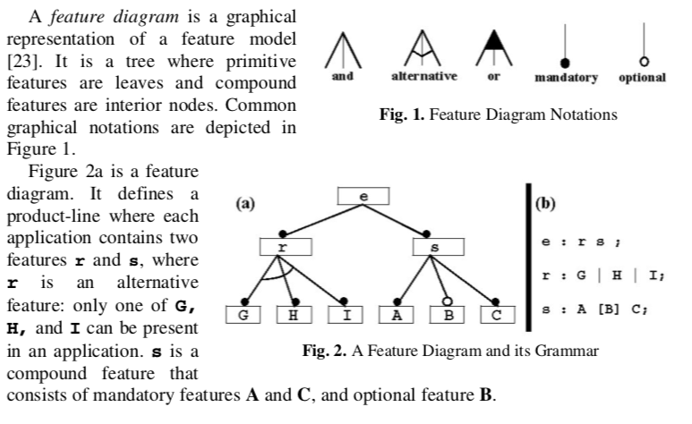
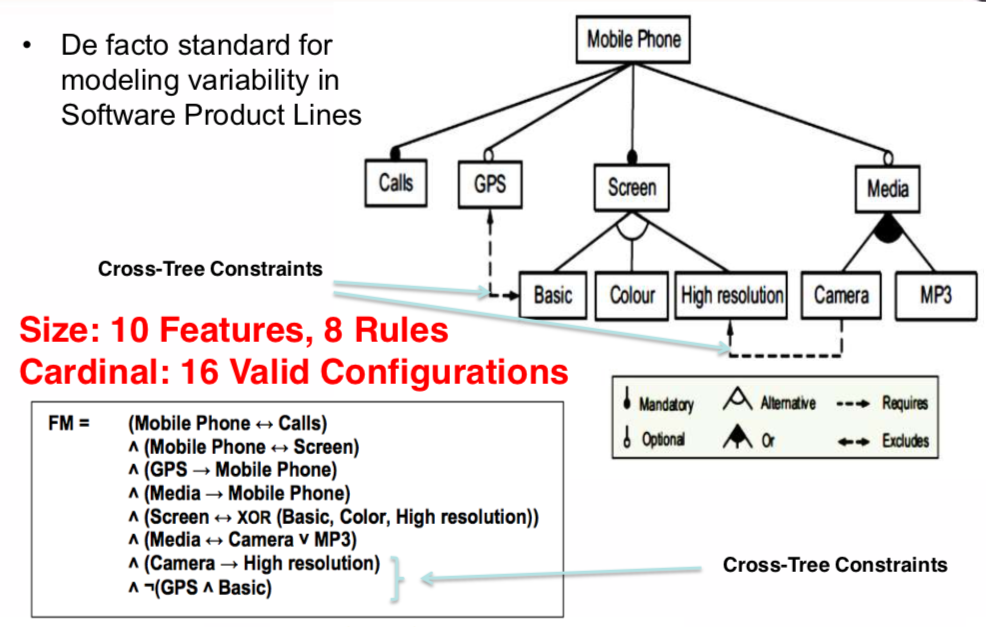

<a name=top>&nbsp;
 </a>
[home](http://tiny.cc/ase19#top) | 
[copyright](https://github.com/txt/ase19/blob/master/LICENSE.md#top) &copy;2019, tjmenzie&commat;ncsu.edu 
    
[syllabus](https://github.com/txt/ase19/blob/master/syllabus.md#top) | 
[src](http://menzies.us/fun) | 
[submit](http://tiny.cc/ase19give) | 
[chat](https://ase19.slack.com/) 

#  Theorem Provers

_"Anyone who thinks modeling is easy, hasn't done it."_  -- timm    
_"Manual modeling is why I ran away to data mining."_   -- timm

Given data, then
data miners let us divide that space, and optimizers tells us how
to jump around that space.

- Which begs the question: how do we generate that space in the first place?

- Welcome to the wonderful world of modeling; i.e.:

What is modeling:

- take all you know
or imagine or guess about a domain, 
- then committing that to some executable,
then checking that code, 
- then running that code
- then trusting the conclusions that come from that code,

## Modeling is Hard

Now this approach is not cheap. There is:

- The _modeling cost_ to build a _systems
  model_(summarizing some situation)
  then a _properties models_ (the invariant
  that must hold in a domain)
  -  Note that building the _properties_
     model can be outrageously expensive,
     slow, tedious since this requires
     committing to what is true and
     improtant in a domain.
  -  Probabilistic programming is an interesting method to reduce the
     systems modeling cost (you do not need to specify everything
     exactly-- near enough is good enough). But this approach is still
     highly experimental.
  -  Some recent work suggests that we can get these models for free, in 
     [Cloud environments](https://github.com/txt/ase19/blob/master/etc/img/whalen.pdf).  
     In that world, users are always writing configuration files describing how
     to set up and run their systems. Those descriptions _must_ be right (otherwise
     the cloud won't run) and automatic tools can derive proprties models
     automatically from those decriptions.
- The _execution cost_ of searching
  through the models. 
  - If those models are very simple, then the _execution cost_ can be small
    e.g. [milliseconds](https://github.com/txt/ase19/blob/master/etc/img/whalen.pdf).  
  - But in the usual case, an exhaustive
     search is impractical for anything
     more that just trivially small models.
  - Sequential model optimization can sometimes reduce this execution cost.
  - Monte Carlo methods let us sample across a space of possibilities.
    Sometimes, stable conclusions can be found within that space.
    - And tools like probabilistic programming might be ways
      to better guide those Monte Carlo simes
- The _verification cost_ associated with checking if the model
  is adequate. Note that such a test of adequacy requires a working
  _properties model_ and an working _execution_ engine
  - See the recursive  problem here?
- The _personnel cost_ required to
  find and train the analysts who can work
  in the formal modeling languages.
  Note that such analysts are hard to 
  find and retain. 
  - To reduce this cost, sometimes it is possible
    to use lightweight notations that reduce the training
    time required to build that models.
  - E.g. see the statechart representations
    of [Fig1, Fig9, Fig12](https://pdfs.semanticscholar.org/cd54/767be60ffcdbdcc20c784485382c7bf8ced0.pdf).
  - But even if the notation is lightweight, analysts
    still need the business knowledge required to write the right models.
- The _development brake_. The above
  costs can be so high that the requirements
  can be frozen for some time before
  we perform the analysis. Note that
  slowing
  down requirements in this way can
  be unacceptable.

Modeling in software engineering
is an old problem with many solutions such as lightweight modeling
languages, domain specific languages, general-purpose
modeling tools, etc. 

Here we talk about one specific kind of modeling language, which
comes with its own execution tools. Its a modeling language many
of us have some familiarity with. Welcome to formal logical models.

## Feature Models to Clauses

101:

Example:

More complex (with temporal operators):

- [http://ext.math.umass.edu/~avrunin/papers/dwyer98-fmsp-patterns.pdf](http://ext.math.umass.edu/~avrunin/papers/dwyer98-fmsp-patterns.pdf)

