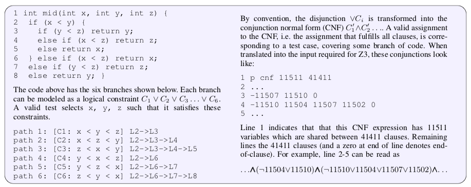
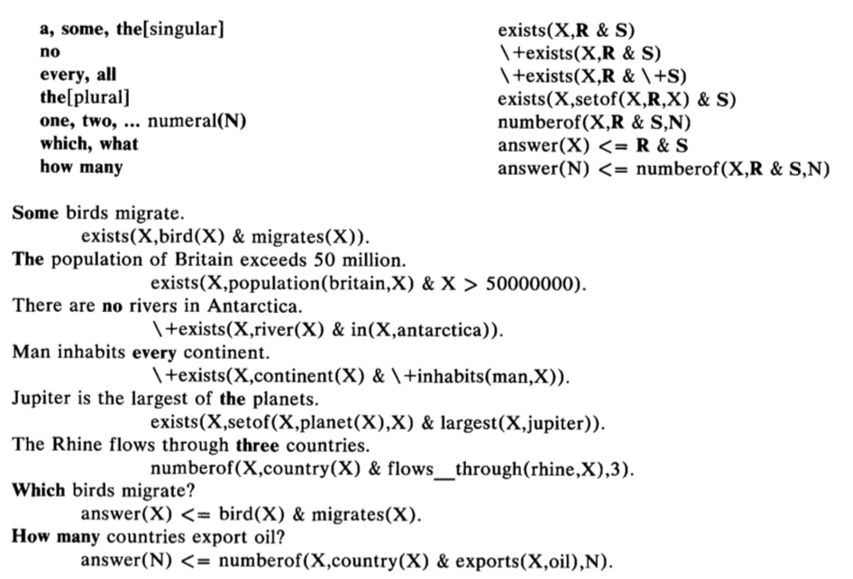
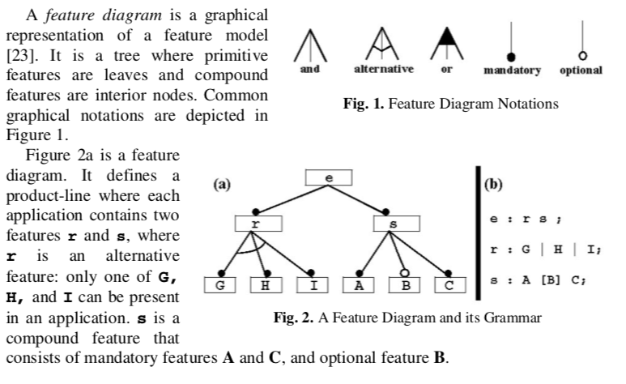
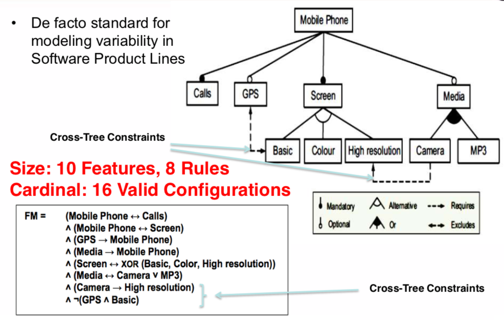

<a name=top>&nbsp;<p> </a>
[home](http://tiny.cc/ase19#top) | 
[copyright](https://github.com/txt/ase19/blob/master/LICENSE.md#top) &copy;2019, tjmenzie&commat;ncsu.edu 
<br> [](http://tiny.cc/ase19)<br> 
[syllabus](https://github.com/txt/ase19/blob/master/syllabus.md#top) | 
[src](http://menzies.us/fun) | 
[submit](http://tiny.cc/ase19give) | 
[chat](https://ase19.slack.com/) 

#  Theorem Provers

_"Anyone who thinks modeling is easy, hasn't done it."_  -- timm    
_"Manual modeling is why I ran away to data mining."_   -- timm

Given data, then
data miners let us divide that space, and optimizers tells us how
to jump around that space.

- Which begs the question: how do we generate that space in the first place?

- Welcome to the wonderful world of modeling; i.e.:

What is modeling:

- take all you know
or imagine or guess about a domain, 
- then committing that to some executable,
then checking that code, 
- then running that code
- then trusting the conclusions that come from that code,

## Modeling is Hard

Now this approach is not cheap. There are many such costs:



There is the _modeling cost_ to build a _systems
  model_(summarizing some situation)
  then a _properties models_ (the invariant
  that must hold in a domain)

-  Note that building the _properties_
   model can be outrageously expensive,
   slow, tedious since this requires
   committing to what is true and
   important in a domain.
-  Probabilistic programming is an interesting method to reduce the
   systems modeling cost (you do not need to specify everything
   exactly-- near enough is good enough). But this approach is still
   highly experimental.
-  Some recent work suggests that we can get these models for free, in 
   [Cloud environments](https://github.com/txt/ase19/blob/master/etc/img/whalen.pdf).  
   In that world, users are always writing configuration files describing how
   to set up and run their systems. Those descriptions _must_ be right (otherwise
   the cloud won't run) and automatic tools can derive properties models
   automatically from those descriptions.

There there is  the _execution cost_ of searching
  through the models. 

- If those models are very simple, then the _execution cost_ can be small
  e.g. [milliseconds](https://github.com/txt/ase19/blob/master/etc/img/whalen.pdf).  
- But in the usual case, an exhaustive
   search is impractical for anything
   more that just trivially small models.
- Sequential model optimization can sometimes reduce this execution cost.
- Monte Carlo methods let us sample across a space of possibilities.
  Sometimes, stable conclusions can be found within that space.
  - And tools like probabilistic programming might be ways
    to better guide those Monte Carlo simes

Also there is

-  The _verification cost_ associated with checking if the model
  is adequate. Note that such a test of adequacy requires a working
  _properties model_ and an working _execution_ engine
  - See the recursive  problem here?
- The _personnel cost_ required to
  find and train the analysts who can work
  in the formal modeling languages.
  Note that such analysts are hard to 
  find and retain. 
  - To reduce this cost, sometimes it is possible
    to use lightweight notations that reduce the training
    time required to build that models.
  - E.g. see the statechart representations
    of [Fig1, Fig9, Fig12](https://pdfs.semanticscholar.org/cd54/767be60ffcdbdcc20c784485382c7bf8ced0.pdf).
  - But even if the notation is lightweight, analysts
    still need the business knowledge required to write the right models.
- The _development brake_. The above
  costs can be so high that the requirements
  can be frozen for some time before
  we perform the analysis. Note that
  slowing
  down requirements in this way can
  be unacceptable.

Modeling in software engineering
is an old problem with many solutions such as lightweight modeling
languages, domain specific languages, general-purpose
modeling tools, etc. 

Here we talk about one specific kind of modeling language, which
comes with its own execution tools. Its a modeling language many
of us have some familiarity with. Welcome to formal logical models.

## Feature Models to Clauses



101:



Example:




More complex (with temporal operators):

- [http://ext.math.umass.edu/~avrunin/papers/dwyer98-fmsp-patterns.pdf](http://ext.math.umass.edu/~avrunin/papers/dwyer98-fmsp-patterns.pdf)

## So Now we Have Clauses, What Next?

Welcome to DIAMCS CNF:


An example of CNF is:

```
  (x1 | -x5 | x4) & 
  (-x1 | x5 | x3 | x4) & 
  (-x3 | x4).
```

The DIMACS CNF format for the above set of expressions could be:

```
 c Here is a comment. 
 p cnf 5 3 
 1 -5 4 0 
 -1 5 3 4 0 
 -3 -4 0
```

The `p cnf` line above means that this is SAT problem in CNF format with 5 variables and 3 clauses. The first line after it is the first clause, meaning `x1 | -x5 | x4`.

CNFs with conflicting requirements are not satisfiable. For example, the following DIMACS CNF formatted data is not satisfiable, because it requires that variable 1 always be true and also always be false:


```
 c This is not satisfiable. 
 p cnf 2 2 
 -1 0 
 1 0
```

### Picosat 


[PicoSAT](http://fmv.jku.at/picosat/) is a popular
[SAT](http://en.wikipedia.org/wiki/Boolean_satisfiability_problem) solver
written by Armin Biere in pure C.
This package provides Python bindings to picosat on the C level,
i.e. when importing pycosat, the picosat solver becomes part of the
Python process itself.  For ease of deployment, the picosat source (namely
picosat.c and picosat.h) is included in this project.  These files have
been extracted from the picosat source (picosat-965.tar.gz).

Another example (note picosat knows DIMACS):

```
   p cnf 5 3
   1 -5 4 0
   -1 5 3 4 0
   -3 -4 0
```

Here, we have 5 variables and 3 clauses, the first clause being
(x\ :sub:`1`  or not x\ :sub:`5` or x\ :sub:`4`).
Note that the variable x\ :sub:`2` is not used in any of the clauses,
which means that for each solution with x\ :sub:`2` = True, we must
also have a solution with x\ :sub:`2` = False.  In Python, each clause is
most conveniently represented as a list of integers.  Naturally, it makes
sense to represent each solution also as a list of integers, where the sign
corresponds to the Boolean value (+ for True and - for False) and the
absolute value corresponds to i\ :sup:`th` variable::

```
   >>> import pycosat
   >>> cnf = [[1, -5, 4], [-1, 5, 3, 4], [-3, -4]]
   >>> pycosat.solve(cnf)
   [1, -2, -3, -4, 5]
```

This solution translates to: `x1=x5=True` and
`x2=x3=x4=False`.

To find all solutions, use `itersolve`::

```
   >>> for sol in pycosat.itersolve(cnf):
   ...     print sol
   ...
   [1, -2, -3, -4, 5]
   [1, -2, -3, 4, -5]
   [1, -2, -3, 4, 5]
   ...
   >>> len(list(pycosat.itersolve(cnf)))
   18
```

In this example, there are a total of 18 possible solutions, which had to
be an even number because `x2`` was left unspecified in the clauses.

Using
the `itertools` module from the standard library, here is how one
would construct a list of (up to) 3 solutions::

```
   >>> import itertools
   >>> list(itertools.islice(pycosat.itersolve(cnf), 3))
   [[1, -2, -3, -4, 5], [1, -2, -3, 4, -5], [1, -2, -3, 4, 5]]
```

Note that when a satsolver generates mulitple solutions,
they are not randomly distributed. So that raises an issue
when using satsolvers to build some solutions to initialize
a multi-objective search.


#### Implementation of itersolve


How does one go from having found one solution to another solution?
The answer is surprisingly simple.  One adds the *inverse* of the already
found solution as a new clause.  This new clause ensures that another
solution is searched for, as it *excludes* the already found solution.
Here is basically a pure Python implementation of `itersolve` in terms
of `solve`::

```
   def py_itersolve(clauses): # don't use this function!
       while True:            # (it is only here to explain things)
           sol = pycosat.solve(clauses)
           if isinstance(sol, list):
               yield sol
               clauses.append([-x for x in sol])
           else: # no more solutions -- stop iteration
               return
```

This implementation has several problems.  Firstly, it is quite slow as
`pycosat.solve` has to convert the list of clauses over and over and over
again.  Secondly, after calling `py_itersolve` the list of clauses will
be modified.  In pycosat, `itersolve` is implemented on the C level,
making use of the picosat C interface (which makes it much, much faster
than the naive Python implementation above).

Note that there is no guarantee that the above is efficient.
So in practice we 
