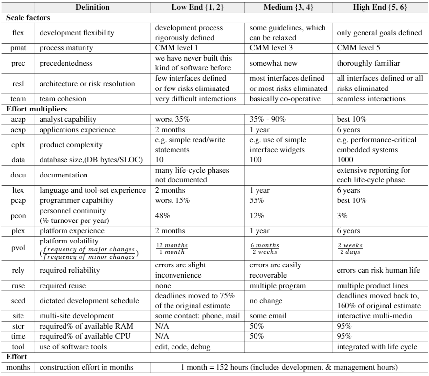

<a name=top>&nbsp;<p> </a>
[home](http://tiny.cc/ase19#top) | 
[copyright](https://github.com/txt/ase19/blob/master/LICENSE.md#top) &copy;2019, tjmenzie&commat;ncsu.edu 
<br> [](http://tiny.cc/ase19)<br> 
[syllabus](https://github.com/txt/ase19/blob/master/syllabus.md#top) | 
[src](http://menzies.us/fun) | 
[submit](http://tiny.cc/ase19give) | 
[chat](https://ase19.slack.com/) 


# Review 6

Evolution has the following three operators that support optimization. Describe each one. Comment on what happens if each
turns off, or if each runs away out of control:

- Mutation
- Crossover
- Select

Given an expression _y = x<sup>2</sup>  - x_, show  where _y_ will be minimal  (hint: use differentiation or draw the curve).

Here are several reason discussed in lectures why standard numeric methods (such as those discussed above) may not
work for software systems. Explain each one, with examples.

- Symbols. not numbers
- Uncertainty
- Discontinuities
- Constraints

What is the problem of local maxima (or minima)? For each of the following, define each and comment
on how they might address the issue of local maxima:

- restart/retries
- Explore a population
- Momentum
- Particle swarm optimizations
- Random jiggle

When would you recommend _sequential model optimization_ (SMO)? SMO has the following stages. Explain each one (ideally, with examples). Why does, overall, this approach lead to less labeling?

1. Look a little
2. Learn a little
3. Guess a lot
4. Apply an _Acquisition function_ to select the "most interesting guess" 
  - For this part, describe how you might might find "the region of most uncertainty" is 3 different learning schemes
  - What could be  the role of `mean` and `variance` in this acquisition function?
5. Ask one question
6. Goto 2.


## Agile vs Waterfall

The POM3 and XOMO models distinguish between waterfall and agile development processes.

- For waterfall, define requirements, coding, testing. In what order are these stages conducted?
- For agile, define scrum, the scum backlog, and sprints. Hint: see the following diagram:


### XOMO (estimation methods for waterfall projects)



- According to Norman Fenton, software project descriptors divide into _personnel_ attributes (that discuss who
  is doing the work) and _product_ attributes (that discusses what is being built) and _process_ attributes
  that discuss _how_ the work is being done. Define and describe the following. For each of the following,
  describe and explain what happens if that attribute is doubled or halved. (Hint: consider 
  the above table.)
  - two XOMO personnel attributes
  - two XOMO product attributes
  - two XOMO process attributes
- In the  COCOMO, some attributes effect the effort estimate by a _linear_ amount and some by an _exponetial_ amount:
  - Describe two COCOMO attributes with an exponential effect
  - Describe two COCOMO attributes with an linear effect

- Here is one of the XOMO tables. What is `sced` and `cplx` (Hint: see above table). What is this table saying
  is a _risky idea_?

```python
risktable['sced','cplx'] = ("0 0 0 1 2 4,"
                              "0 0 0 0 1 2,"
                              "0 0 0 0 0 1,"
                              "0 0 0 0 0 0,"
                              "0 0 0 0 0 0,"
                              "0 0 0 0 0 0")
```

### POM3 (estimation for agile methods)


- In POM3, what is the "requirements tree"?
  - Why can't developers see all the requirements at the start of agile project
- One of the  POM3 outputs is `idle`. Why is `idleness` a problem when teams coordinate on agile projects,
  all the while reorganizing  their work as new requirements emerge?
- What steps could an organization take to change:
  - team size
  - failure consequence
  - stability of requirements
  - worker skill level level
  - organization culture
  
