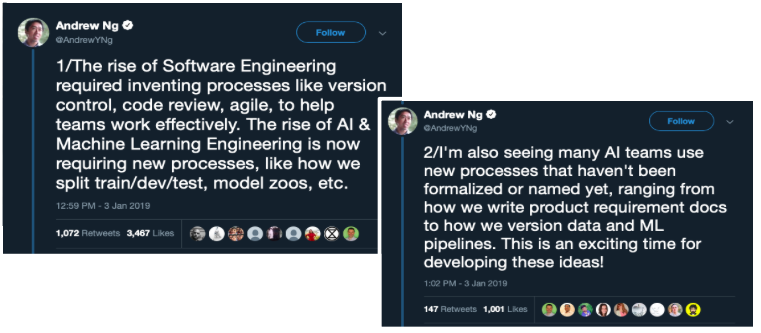
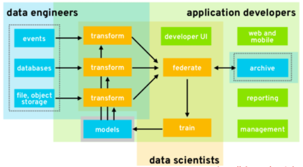
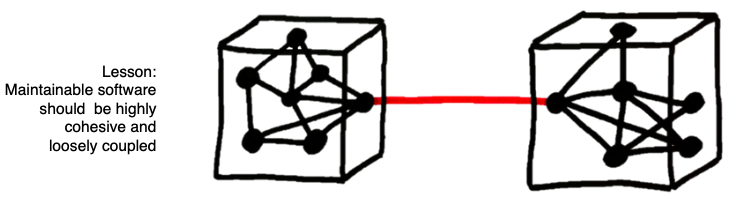
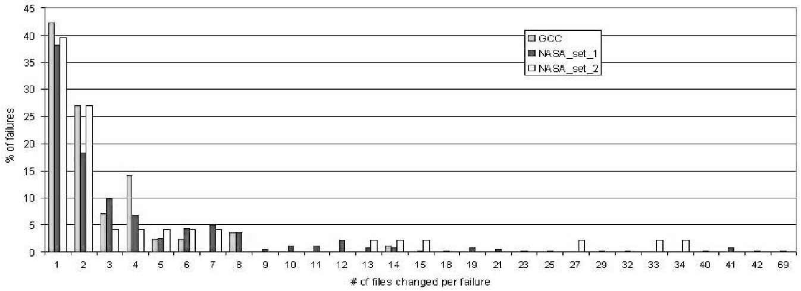

<a name=top>&nbsp;<p> </a>
[home](http://tiny.cc/ase19#top) | 
[copyright](https://github.com/txt/ase19/blob/master/LICENSE.md#top) &copy;2019, tjmenzie&commat;ncsu.edu 
<br> [](http://tiny.cc/ase19)<br> 
[syllabus](https://github.com/txt/ase19/blob/master/syllabus.md#top) | 
[src](http://menzies.us/fun) | 
[submit](http://tiny.cc/ase19give) | 
[chat](https://ase19.slack.com/) 


# But Why Study SE for AI?

It is timely to talk about SE for AI. 



## AI software is still software 

AI software is still software.
All  software
   (be it AI software, or otherwise) needs installation, configuration,
   maintenance, interfacing to other software, testing, certification,
   user support, usability additions, and packaging (for distribution).
   As shown below, Bill Benton from Redhat [reports that](REFS.md#benton-2019) 
that when we look at the data mining
   pipelines used to distribute and scale AI tools, there is  much
   overlap between the activities of data scientists and   more
   traditional activities  like data engineer and application
   developer. That is, **AI software needs care and feeding by
   software engineers**.

  

## Most "AI" Software is not about AI

Another reason to explore SE for AI is that **most "AI software"
   is not about AI**.   David Sculley  [offers the following
   diagram](REFS.md#sculley-2015) showing the size (in lines of
   code) of  Google's software suite. Note how small is the AI box
   (shown in black), buried away in the middle of all the other
   software.


## Poor SE Leads to Poor AI

Since AI software is still software, it follows that **poor
   software engineering leads to poor AI**. Again, David Sculley
   [offers us an example of this](REFS.md#sculley-2015).  He reports
   that Google's machine learning developers used all of the
   attributes in Google's data dictionaries to learn predictive
   models about browsing habits. This lead to problems since any
   subsequent change in the data dictionary meant that all the data
   mining had to be done, all over again. In software engineering
   terms, Google had introduce technical debt (i.e. something that
   will consume maintenance money at some future date) by violating
   principles of coupling and cohesion. Maintainable systems are
   loosely coupled (but internally, tightly cohesive). Google's
   classifiers, on the other hand were tightly coupled with their
   data dictionaries.  A better design, that would have looser
   coupling would have been to apply some sort of feature weighting
   to the data, and only connect to the least features that were
   most influential.



## Better SE Leads to Better AI

While poor software engineering can lead to problems with the AI,
the good news is that
   **better SE can lead to better AI**. For example, many industrial
   data scientists make extensive  use of the [Python scikit-learn
   toolkit](REFS.md#pedregosa-2011) data mining package. Started
   in 2007 as a Google Summer of Code project by David Cournapeau,
   numerous releases have appeared following a (approximately) three
   month cycle, and a thriving international community has been
   leading the development. At the time of this writing, over the
   last month, this software has been maintained and extended by
   dozens of authors, spread around the planet (specifically,
   excluding merges, 50 authors have pushed 119 commits to master
   and 119 commits to all branches to make changes thousands of
   lines of code in  279 files). All this is possible since
   scikit-learn uses state-of-the-art open source software engineering
   methods (continuous integration, cloud-based testing with Travis
   CI, git, github, etc etc).

Since good SE can lead to better AI, we devoted many  chapters of
this book to industrial data mining pipelines.   Recently we 
[reversed engineered](REFS#amershi-2019) a nine-step pipeline for industrial machine learning.
For simplicity's sake, we draw it as steps that run left to right
(but in reality, **AI is an agile process** where we jump around
these steps, as required):


We also surveyed many industrial data scientists to understand how much time they spend on different parts of this pipeline:

```
               WHAT HOURS
       requirements   4.4 ------------------------------------------
         collection   4.7 ---------------------------------------------
           cleaning   4.5 -------------------------------------------
          labelling   2.9 ----------------------------
feature engineering   4.6 --------------------------------------------
     model training   5.4 ----------------------------------------------------
         evaluation   3.8 ------------------------------------
         deployment   5.1 -------------------------------------------------
         monitoring   2.6 --------------------------
```

One interesting feature about the above histogram is that **most
"data mining" is not about mining the data**.  We say this since,
in  a 35 hour work week, only half a day (5.4.hours) was spent in
_training_. This is interesting since most data mining textbooks
_only_ talk about training. Hence, if we are going to talk SE for
AI, there is a pressing need to discuss all the work that fills up
the other four days of the week.

## SE Needs Special Kinds of AI

We've been applying SE tools to AI for decades now are there are
some strange results suggesting that SE needs its own special kinds
of AI:

There are some good reasons for this.:

- Strange to say, software does not correspond to the mathematical definition of a function; i.e. outputs determined by some input.
     - In pratice, one piece of software has many if-statemebts which means that the whole state space of the system divides into thousands to millions of tiny pieces,
each with their own properites. 
     - Which means that when (e.g.) optimizing, then rule-based methods (that divide their knowledge
       into multiple regions) [can do better](https://www.umsec.umn.edu/sites/www.umsec.umn.edu/files/10tar3.pdf) than numeric optimizers (that tend to reason about the
       program as one global space).
- Another 
<a href="https://scx2.b-cdn.net/gfx/news/hires/2008/zipfslaw.gif"></a>
thing is [naturalness](REFS.md@hindle-2012). Software is written in a language. Languages have use a few repeated structures that [occur with high frequency, and many more structures with much lower frequency](https://phys.org/news/2008-12-linux-evolution-reveals-curious-mathematical.html). This changes the nature of the analysis since just a few things cover the most of the mass of possibilities.
<br clear=both>
- Because 
<a href="../etc/img/bugs.png"></a>
of the other two points, or perhaps because of them, software's internal behavior clumps. Software does not spent all its time roaming over
  all its internal state space. Rather, there are a few things that happen nearly all the time and many things that happen rarely. One result
of this is (e.g.) bugs cluster such that most of the bugs are found in a  very small part of the code.

All the above changes the nature of how we analyse software, of how we apply AI to SE and how SE can inform the process of building and use AI software. 

- One repeated results is the [keys effect](http://menzies.us/pdf/07strange.pdf); i.e. 
[controlling a very small number of variables is enough to control all the rest](https://arxiv.org/pdf/1702.05568.pdf).
- This means that AI for SE can be done via [carving](https://researchrepository.wvu.edu/cgi/viewcontent.cgi?article=4403&context=etd); i.e. throw away the stuff that does not matter and just reason about the rest


Want more details? Then read on!


