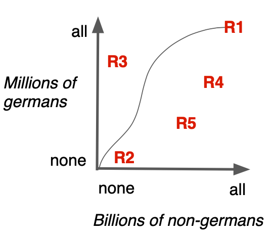
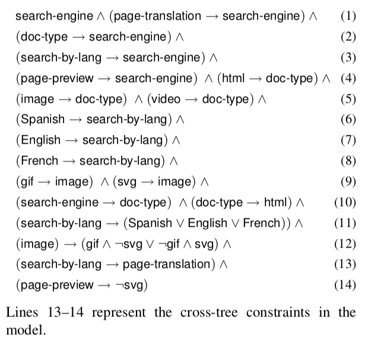

<a name=top>&nbsp;<p> </a>
[home](http://tiny.cc/ase19#top) | 
[copyright](https://github.com/txt/ase19/blob/master/LICENSE.md#top) &copy;2019, tjmenzie&commat;ncsu.edu 
<br> [](http://tiny.cc/ase19)<br> 
[syllabus](https://github.com/txt/ase19/blob/master/syllabus.md#top) | 
[src](http://menzies.us/fun) | 
[submit](http://tiny.cc/ase19give) | 
[chat](https://ase19.slack.com/) 


#  Tools

Before going on, we digress to introduce some of  the technology
explored in this book. Taken together, these tools are a  vast array
of methods for building models. The ethically-aware engineer can
take advantage of this vast space by selecting models that better
satisfy ethical goals. Further, AI tools can be used to explore this space of models (and to do so, very quickly).

## Data Miners

 **Data mining algorithms** tell us "what is" in the data. Data miners extract models   from data. 
Sample  data mining algorithms
 are :

- nearest neighbor algorithms like kNN; 
- clustering algorithms like k-Means and EM; statistical learners like Naive Bayes; 
- equation learners like linear or logistic regression; 
- decision tree learners like C4.5,   and CART; 
- meta-learners like AdaBoost; 
- and many other as well including  Apriori, PageRank,  neural networks (and deep learners); 
- etc.

For example, suppose we have data on hundreds of cars and we want to predict their city-cycle fuel consumption in miles per gallon. That data has the following format:

| attribute   | range     |
|-------------|-----------|
| mpg         | continuous |
| cylinders   | multi-valued discrete |
| displacement| continuous |
| horsepower  | continuous |
| weight      | continuous |
| acceleration| continuous |
| model year  | multi-valued discrete |
| origin      | multi-valued discrete: 1=USA; 2=Europe; 3=Japanese |


When run through the CART regression tree learner, those  hundreds of examples generate the following model:

```
displacement <= 190.5 : 
|   weight <= 2219.5 : 
|   |   model-year <= 77 then mpg = 30
|   |   model-year >  77 then mpg = 34
|   weight >  2219.5 : 
|   |   model-year <= 78 : 
|   |   |   weight <= 2775 then mpg =  25
|   |   |   weight >  2775 then mpg = 23
|   |   model-year >  78   then mpg = 28
displacement >  190.5 : 
|   displacement <= 261  then mpg = 20
|   displacement >  261 : 
|   |   model-year <= 76 then mpg = 15
|   |   model-year >  76 then mpg = 19
```

This model can be read as nested set of  if-then-else statement.
For example, if displacement is small (under 190.5) then we enter the top tree. Else, we enter the bottom tree. 
The leaves
of the tree offer predictions. For example:

-  If displacement is small (under 190.5) and the car is not heavy (weight under 2220 pounds) and its an early model care (before 1977)
- then this model predicts that that car gets 30 miles per gallon.

Before going on, one fun thing to note about this tree is what
is does **not** contain.  This data miner  found that  cylinder,
horsepower, acceleration,  origin were not as insightful as the
other attributes used in this tree (and for that reason, they were ignored). This is not to say that these ignore attributes
are unimportant for predicting miles per hour-- just that combinations
of other values were more important. 
Experienced analysts know that such negative results 
(that some attributes can be ignored) 
are important (\*)
since they let us simplify how we report models,  thus simplifying  all the subsequent activity inspired by that model. 

(\*) From the _Adventure of Silver Blaze_ by Arthur Conan Doyle.<br>Gregory (Scotland Yard detective): "Is there any other point to which you would wish to draw my attention?"<br> Holmes: "To the curious incident of the dog in the night-time."<br> Gregory: "The dog did nothing in the night-time."<br> Holmes: "That was the curious incident." 

## Optimizers

Optimizers tell us "what to do". Optimizers look  at the data generated from models
and tell us how changes in something effects something else. 
Ideally,
optimizers also tell us the <em>least_</em> we need to do to
<em>most</em> improve something. 
Sample optimizers include:

- genetic algorithms like NSGA-II,
MOEA/D and differential evolution;   
- sequential model-based
optimization methods like FLASH and SMAC; 
- and other approaches such
as particle swam optimization, tabu search; 
- and many more besides

While <b>data miners are data-based</b>, 
<b>optimizers are model-based</b>:

-  Data miners explore whatever data is available.
-  Models, on the other hand, can be used to build more data whenever they want, just by running the model some more. 

This means that:

-  data miners explore a fixed data space
- while optimizers explore a more fluid data set (since they can  zoom into little cracks in the data, expanding that part of the data as they go).


For example, returning to the car data example described above, suppose the car data was generated from  a computer-aided design package that inputs 100s of attributes
about the design to output predictions about the car weight, acceleration and miles per hour (in the city). Now our designers want to know what design attributes to change
in order to

- minimize weight
- maximize acceleration
- and maximize miles per hour.

One way to do that is to generate some data, then sort it such that:

- the best cars (which are  light and nimble cars with low mph) appear first;
- the worst cars (which are heavy, sluggish cars with high mph) appear last.

Applying such a criteria, the car data looks like:


|      |cylinder&nbsp;| displacmnt&nbsp;| hpower&nbsp;| <weight&nbsp;| >acceltn&nbsp;| model&nbsp;| origin&nbsp;| >mpg|
|------|--------|----------|-------|-------|---------|------|------|-------|
|best |4       | >85       | <46   | 1975  |  19.4   |  >81 |  3   |   40  | 
|best |4       | >85       | <65   | 1985  |  21.5   |  >78 |  2   |   40  |
|best |4       | >85       | <65   | 2085  |  21.7   |  >80 |  2   |   40  |
|best |4       | >96       | <65   | 2130  |  24.6   |  >82 |  2   |   40  |
|..  .|...     | ...       | ...   | ...   |  ..     |  ... |  ... |   ... |
|worst|8       | >383      | >165  | 4746  |  12     |  <71 |  1   |   10  |
|worst|8       | >3835     | >165  | 4951  |  11     |  <73 |  1   |   10  |
|worst|8       | >383      | >165  | 4952  |  11.5   |  <73 |  1   |   10  |
|worst|8       | >383      | >165  | 4955  |  11.5   |  <71 |  1   |   10  |
|     |        |           |       | minimize| maximize|    |       | maximize      |


Optimizers use this data to find a set of changes (also know as "mutations")  which, if applied to the cars, will make them weigh less, speed up faster, and use less gas.

- Some optimizers just reason about the best rows;
- While others reason about the delta between the  best and worse rows.

In either case, the goal is to find  minimal changes to the model
inputs which will generate better cars. Once those changes are
applied, the whole process can repeat for many _generations_ (and
within each generation, we generate more data, look for good changes,
then apply those changes).

Before going on, one fun thing to note is that all optimizers could
use data mining.  When optimization  gets too slow, one way to speed
it up is to cluster large problems into numerous smaller ones.  For
example, [Majumder et al.](majumder-2018) used k-means clustering
to divide up a complex text mining problem, then apply optimizers
within each cluster. They report that this method speeds up their
processing by up to three orders of magnitude.

Note only that, but i a very real sense,e very dat miner uses optimization
(if not overtly, then woven into its core framework).
To see that, consider three rules R1,R2,R3:

- R1 is a rule  that says "everyone is German". This rule will find all Germans but
  it will also have high false alarms (in fact, in a world population of 7.7 billion,
  this rule will get it wrong  over 7.6 billion times).
- R2 is another rule  that says "no one is German". This rule will never make a mistake in that
   it will
  never declare a non-German to be German. However, it will also never correctly tag as German
  anyone from Germany.
-  Clearly, neither of these two rules are ideal and the best rule is
   some trade-off between the two. The following diagram shows R1 and R2 as well as a
   compromise rule called R3 (which might test things like what language do you speak
   at home; or what was the longitude  of your birth place). Sure, R3 does not find all the Germans,
   but it does not have all the performance drawbacks of R1 or R1.



The above diagram shows our rules in a trade-off diagram called
a
"ROC curve" (receiver operator characteristics). ROC curves show
how much a rule covers all the positive and negative examples. On that curve, the "heaven"
point is top-left where we cover all the positive examples and none of the negative ones. Note
that if we generated a million rules at random then some of them like R4,R5 would be "buried" 
behind other, better rules. On that diagram, the Pareto frontier are all the rules with nothing
between them and heaven. This frontier holds
all the rules that are not clearly worse than something else.

The point of this example is that when exploring different models, all learners are optimizers
that "surf" this
ROC curve, trying to "flow" their knowledge towards the Pareto frontier 
(where that knowledge is clearly better than
than anything else). Some learners use this ROC curve explicitly, others use various
very fast heuristics which, experience has shown, drive the knowledge towards the frontier.

## Theorem Provers

**Theorem provers** are very specialized tools for finding settings to variables that satisfy the logical constraints of a model. Such a theorem provers might report that  A=true and B=false satisfies the constraint (A and not B).   
Sample theorem provers include:

-  maxWalkSat, pycoSAT, MathSAT, vZ, Z3
-  and many more besides.

For example, [Mendonca et al.](REFS.md#mendonca-2009) offer the following feature model  describing  a tree of options about a search engine. In this diagram,   a filled/hollow circle means 
"mandatory"/"optional" (respectively). Also, white/dark fans means "and","or" (respectively). 


This tree can be expressed as:



Note the last two theorems (lines 13,14). Without these two lines then any choice in any sub-tree is valid (so it is easy to design a search engine).
However, with these _cross-tree constraints_ we have to be more careful.  Technically, the presence of these cross-tree constraints makes this problem
NP-hard (i.e. can be very slow, especially when the theory grows larger and larger).. 

A theorem provers can explore this model and find product design that satisfy all these constraints. While this is trivial in this case (cause the model is so small), theorems
about real-world software rapidly get very large:

- A feature model of the LINUX kernel has 4000 variables and over 100,000 constraints;
- When software branches are expressed as theorems, those theorems get very large indeed (more than thousands of variables and tens of thousands of constraints).

Such large theories are too hard to use just via a manual inspection--   which is why we need theorem provers.

## Combinations of the Above

Note also that optimizers and data miners are tightly inter-connected:

- Data miners can learn a model which [can be used by optimizers](REFS.md#feather-2002).  
- Optimizers can [adjust the control parameters of a data miner](REFS.md#fu-2016) such that those data miners learn better models (technical note: this is called [search-based software engineering](REFS.md#harman-2012)).

In our literature review, we have seen several different kinds of combinations of data miners and optimizers:

- Theorem provers as data generators:  
    - when models come with many constraints, we can use theorem provers to [generate valid examples](REFS.md#chen-2018a);
- Optimizers to improve theorem provers: 
    - Theorem provers deliver solutions in whatever order is dictated  by their internal design. This means, when
     there are very many ways to solve constraints, theorem provers can take a long time to generate solutions that we prefer. In
  this case, a common strategy is to first , run theorem provers (a little) to get a sample of solutions; then  second
      run mutators and optimizers to [combine that sample in interesting ways](REFS.md#chen-2019).
- Mash-ups of data miners and optimizers: 
    - In this approach, data miners and optimizers can be seen as separate executables. For example, Abdessalem et al. [1] generate test cases for autonomous cars via a cyclic approach where an optimizer reflects on the output of data miners that reflect on the output of an optimizer (and so on).
- Data miners acting as optimizers: 
    - In this approach, there is no separation between the data miner and optimizer. For example, [Chen et al.](REFS.md#chen-2018a)
show that their recursive descent bi-clustering algorithm (which is a data mining technique) out-performs traditional evolutionary algorithms for the purposes of optimizing SE models.
- Optimizers control the data  miners: 
    - In this approach,the data miner is a sub-routine called by the optimizer. For example, several recent papers improve predictive performance via optimizers that tune the control parameters of the data miner (See [Agrawal 2018a](REFS.md#agrawal-2018a), 
   [Fu'18](REFS.md#fu-206), and [Tantithamthavorn et al/](REFS.md#Tan-2016a)).
- Data miners control the optimizers:
    -  In this approach, the optimizer is a sub-routine called by the data miner. For example, 
[Majumder et al.](REFS.md#majumder-2018) use k-means clustering to divide up a complex text mining problem, then apply optimizers within each cluster. They report that this method speeds up their processing by up to three orders of magnitude.


