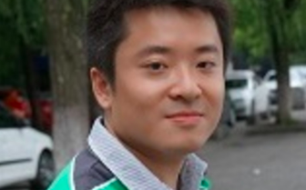

<a name=top>&nbsp;
 </a>
[home](http://tiny.cc/ase19#top) |
[copyright](https://github.com/txt/ase19/blob/master/LICENSE.md#top) &copy;2019, tim&commat;menzies.us
 
 
[syllabus](https://github.com/txt/ase19/blob/master/syllabus.md#top) |
[src](http://menzies.us/fun) |
[submit](http://tiny.cc/ase19give) |
[chat](https://ase19.slack.com/)

# Syllabus

Fall 2019    
CSC 591-021 (6620)    
CSC 791-021 (9182)   
EB3, 2201    
Tues, Thus, 4:30 to 5:45pm     
rm 2232 Engineering Building 3  

## General description:

Everyone else is studying AI, or applying AI to SE.

- But what about SE for AI? 

AI software is still software. And software needs maintenance, validation, interfacing, usability additions, etc. That is why AI software needs software engineers!

- And not only that, AI software offers special functions that need specialized approaches by software engineers. So what does engineering look like when applied to AI?

Time to find out.  

- Time to learn what happens after DevOps. 
- While DevOps strives to "automate everything," automated software engineering strives to "automate automation." 
- This subject will explore methods to augment standard software engineering practices with AI methods (data miners, optimizers, theorem provers) that peek over our shoulders to say "try this, and don't bother that."  
 

## Objectives

Objectives: by the end of the course, students should be able to
 
1. Build and maintain complex programs.
2. Build and modify and refactor and remix and repurpose AI software (data miners, optimizers, theorem provers) for SE tasks.
3. Discuss issues associated with applying the above to help society, and customers, achieve their goals better, faster, and cheaper.
4. Speak and write on complex technical issue.

## Staff

### Lecturer 

+ Tim Menzies (Prof)
+ Office Hours: Tuesday, 2:00-4:00 and by request
+ Location of Office Hours: EB2 room 3298 
+ Github name: timm
+ Slack name: timm
+ E-Mail: tjmenzie@ncsu.edu
  + Only use this email for private matters. All other class communication should be via the class Slack group [http://ase19.slack.com](http://ase19.slack.com).
+ Phone: 304-376-2859
    + **Do not use** this number, except in the most dire of 
      circumstances (best way to contact me is via email).

### Teaching assistant

+ Rui Shu  
+ Office Hours: TBD
+ Location of Office Hours: EB2 3240
+ Email: rshu@ncsu.edu
+ Github name: XXX
+ Slack name: XXX

 

## Details

### Group Mailing List

During term time, all communication will be via
the Slack group https://ase19.slack.com.
. Students are strongly encouraged to contribute their questions and answers to that shared resource.
+ Note that, for communication of a more private nature, contact the lecturer on the email shown above.

### Prerequisite

Note that this is a
**programming-intensive** subject. A programming
background is required in a contemporary language
such as Java or C/C++ or Python. Hence, the
prerequisite for this class is some subject with significant
programming component.
Significant software industry
experience may be substituted, at the instructor's
discretion.  Students in this class will work in
Python, but no background knowledge of that language
will be assumed.

### Expected Workload 

This is tools-based subject
and it is required that students learn and use those
tools (Python, repositories, etc).  Students MUST be
prepared to dedicate AT LEAST 5-8 working hours a
week to this class. 
Laboratory instruction is not included
in this subject (but the first three weeks will be
spent on some in-depth programming tutorials). Note
that the workload for masters and Ph.D. students
will be different (see above).

Sometimes, the lecturer/tutor will require you to attend a review session during their consultation  time. There, students may be asked to review
code, concepts, or comment on the structure of the course. Those sessions are mandatory and failure to attend will result in marks being deducted.

### Grading 

The following grade scale will be used: 

+ A+  (97-100), A (93-96), A-(90-92)
+ B+ (87-89), B (83-86), B-(80-82)
+ C+ (77-79), C (73-76), C-(70-72)
+ D+ (67-69), D (63-66), D-(60-62)
+ F (below 60).

<table><tr><td></td><td>591</td><td>791</td><td>marks</td></tr>
<tr><td>Mid-term (Thursday March1, 6pm)  marks </td><td>&check;</td><td>&check;</td><td>20</td></tr>
<tr><td>Final (Tuesday Dec17, 1pm to 3pm)  </td><td>&check;</td><td>&check;</td><td>30</td></tr>
<tr><td>Homeworks 1,2,3,4,5 </td><td>&check;</td><td>&check;</td><td>5*5=25</td></tr>
<tr><td>Homeworks 6,7,8,9,10 </td><td>&check;</td><td></td><td>5*5=25</td></tr>
<tr><td>Project </td><td></td><td>&check;</td><td></td></tr>
<tr><td> - poster (2 pages) </td><td></td><td>&check;</td><td>3</td></tr>
<tr><td> - presentation (10 mins) </td><td></td><td>&check;</td><td>8</td></tr>
<tr><td> - report (8 pages) </td><td></td><td>&check;</td><td>15</td></tr>
</table>

### Student Groups

791 students must do a project,  in a  group of 1

591 students : you will do your work in a group of 2

### Homeworks/Projects

Masters students are expected to do 10 homeworks, 

### Homework

Homeworks will be done individually. 

Homeworks must be submitted on the due date, otherwise will lose 1 mark late per day.

Until the end of February, homeworks may be resubmitted, after rework, to get obtain higher marks.

Pause.

So, yes, you must submit SOMETHING each week or lose marks. But if you submit and don't get the grade,
you CAN resubmit (at least, up to end of Feb). 

### Attendance

Attendance is extremely important for your learning
experience in this class. Once you reach three
unexcused absences, each additional absence will
reduce your attendance grade by 10%.

Except for officially allowed reasons, your presence in the class if required from day one. 
Late-comers will have to work in their own solo groups (to avoid disruptions to existing groups).

Note that absences for weddings (your own, or someone else's, is not an officially allowed reason).

Exceptions: this subject  will support students who are absent for any of the following
officially allowed reasons:

- Anticipated Absences (cleared with the instructor before the absence).
Examples of anticipated situations include
    - representing an official university function, e.g., participating in a professional meeting, as part of a judging team, or athletic team;
    - required court attendance as certified by the Clerk of Court;
    - religious observances as verified by the Division of Academic and Student Affairs (DASA).
    - Required military duty as certified by the student's commanding officer.
- Unanticipated Absences.  Excuses must be reported to the instructor not more than one week after the return to class.  Examples of unanticipated absences are:
      -  Short-term illness or injury affecting the ability to attend or to be productive academically while in class, or that could jeopardize the health of the individual or the health of the classmates attending.  Students must notify instructors prior to the class absence, if possible, that they are temporarily unable to attend class or complete assignments on time.
      -  Death or serious illnesses in the family when documented appropriately.  An attempt to verify deaths or serious illness will be made by the Division of Academic and Student Affairs.

That support will include changing the schedule of deliverables and/or (in extreme
case) different grading arrangements.

### Academic Integrity

Cheating will be punished to the full extent permitted. Cheating
includes plagerism of other people's work. All students will be working
on public code repositories and **informed reuse** is encouraged where
someone else's product is:

+ Imported and clearly acknowledged (as to where it came from);
+ The imported project is understood, and
+ The imported project is significantly extended.

Students are encouraged to read each others code and report **uninformed reuse**
to the lecturer. The issue will be explored and, if uncovered,
cheating will be reported to the university
and marks will be deducted if the person who is doing the reuse:

+ Does not acknowledge the source of the product;
+ Does not exhibit comprehension of the product when asked about it;
+ Does not significantly extend the product.

All students are expected to maintain traditional
standards of academic integrity by giving proper
credit for all work.  All suspected cases of
academic dishonesty will be aggressively pursued.
You should be aware of the University policy on
academic integrity found in the Code of Student
Conduct.
 
The  exams will be done individually.  Academic integrity is important.  Do not work together on the exams: cheating on either will be punished to the full extent permitted.  

### Disabilities

Reasonable accommodations will be made for students
with verifiable disabilities. In order to take
advantage of available accommodations, students must
register with Disability Services for Students at
1900 Student Health Center, Campus Box 7509,
919-515-7653. For more information on NC State's
policy on working with students with disabilities,
please see the Academic Accommodations for Students
with Disabilities Regulation(REG 02.20.01).

Students are responsible for reviewing the PRRs
which pertain to their course rights and
responsibilities. These include:
http://policies.ncsu.edu/policy/pol-04-25-05 (Equal
Opportunity and Non-Discrimination Policy
Statement), http://oied.ncsu.edu/oied/policies.php
(Office for Institutional Equity and
Diversity),http://policies.ncsu.edu/policy/pol-11-35-01
(Code of Student Conduct), and
http://policies.ncsu.edu/regulation/reg-02-50-03
(Grades and Grade Point Average).

### Non-Discrimination Policy

NC State University provides equality of opportunity
in education and employment for all students and
employees. Accordingly, NC State affirms its
commitment to maintain a work environment for all
employees and an academic environment for all
students that is free from all forms of
discrimination. Discrimination based on race, color,
religion, creed, sex, national origin, age,
disability, veteran status, or sexual orientation is
a violation of state and federal law and/or NC State
University policy and will not be
tolerated. Harassment of any person (either in the
form of quid pro quo or creation of a hostile
environment) based on race, color, religion, creed,
sex, national origin, age, disability, veteran
status, or sexual orientation also is a violation of
state and federal law and/or NC State University
policy and will not be tolerated.

+ Note that, as a lecturer, I am legally required to
  **report** all such acts to the campus policy.

Retaliation
against any person who complains about
discrimination is also prohibited. NC State's
policies and regulations covering discrimination,
harassment, and retaliation may be accessed at
http://policies.ncsu.edu/policy/pol-04-25-05 or
http://www.ncsu.edu/equal_op/. Any person who feels
that he or she has been the subject of prohibited
discrimination, harassment, or retaliation should
contact the Office for Equal Opportunity (OEO) at
919-515-3148.

### Other Information

Non-scheduled class time for field trips or
out-of-class activities are NOT required for this
class. No such trips are currently planned. However,
if they do happen then students are required to
purchase liability insurance. For more information,
see http://www2.acs.ncsu.edu/insurance/
